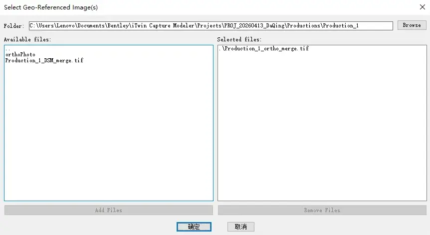
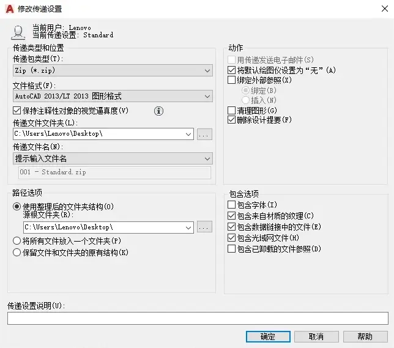

在 AutoCAD 中使用航拍图、正射影像或扫描图时，附着一张影像并不复杂。真正耗时的是批量处理：每张图都要选择文件、确定位置、设置比例和旋转。资料一旦变成几十张 TIF、JPG 或 PNG，再配上相应的 World File 或 ERS，重复操作很快就会成为负担。

INSGEO.lsp 用来处理这类工作。它可以一次选择多张栅格影像，逐张查找配套的坐标文件，并把解析成功的影像插入 ModelSpace。多文件窗口还可以跨目录累计文件，并支持常见的 Windows UNC/NetBIOS 网络共享路径。

需要先说明的是，INSGEO 只是一个批量插入与配准工具，不负责坐标转换。它不会识别或转换坐标参考系，也不会读取 GeoTIFF 内嵌的地理信息。使用前应确认图纸、影像和配准文件采用相同的坐标系与单位。

[TOC]

## 适用范围

脚本允许选择以下影像：

- TIF / TIFF
- JPG / JPEG
- PNG
- ECW

实际能否插入，仍取决于所用 AutoCAD 版本对影像格式和编码方式的支持。

脚本查找以下配准文件：

- ER Mapper 头文件：ERS
- 常见 World File：TFW、JGW、PGW、EWW、WLD
- 对应的长扩展名：TIFW、TIFFW、JPGW、JPEGW、PNGW、ECWW
- 带 x 后缀的常见形式，例如 TFWX、JGWX

当前版本使用 AutoLISP/ActiveX，因此面向 **AutoCAD for Windows**。AutoCAD for Mac、Web 和 AutoCAD LT 不在本文的支持范围内。

坐标处理还有两项限制：

1. World File 可以包含旋转，也可以使用不同的 X、Y 像元尺寸，但像素的行轴和列轴必须正交。带剪切、镜像或退化变换的文件会被拒绝，因为 AutoCAD 的 RasterImage 对象不能安全表达这类仿射变换。
2. ERS 目前只处理北向上的 RegistrationCoord 与 CellInfo。Rotation 不为零时，脚本会跳过该文件。

## 加载和使用

把 INSGEO.lsp 拖入 AutoCAD，或者执行：

```lisp
(load "C:/path/to/INSGEO.lsp")
```

加载成功后，命令行会显示：

```text
INSGEO loaded. Type INSGEO to insert geo-referenced image(s).
```

输入 `INSGEO`，会打开多文件选择窗口：



窗口分为左右两栏：

- 左侧显示当前目录中的文件和子目录；
- 在左侧使用 Ctrl 或 Shift 选择多张影像，然后点击 **Add Files**；
- 右侧显示本次准备插入的文件，可以切换到其他目录继续追加；
- 在右侧选中文件后，点击 **Remove Files** 可以将其移除；
- 确认列表无误后点击 **OK**。

脚本会逐张处理，并在命令行显示进度：

```text
[1/3] ortho_01
  Inserted using ortho_01.tfw.
[2/3] ortho_02
  Inserted using ortho_02.tfw.
[3/3] ortho_03
  Inserted using ortho_03.ers.
Done. 3 image(s) inserted.
```

如果某张影像处理失败，最终统计会分别显示成功数和失败数。只有完成配准并成功更新的影像才会计入成功数。解析失败、格式不支持或对象更新失败时，脚本会尝试删除刚创建的 RasterImage，避免在图中留下未配准的对象。

全部处理完成后，视图会缩放到最后一张成功插入的影像。

## 配准文件怎样匹配

脚本会先按影像文件名，在同一目录中自动查找配准文件。以 `ortho.tif` 为例，查找顺序为：`ortho.ers` → `ortho.tfw` → `ortho.tfwx` → `ortho.tifw` → `ortho.wld`。

JPG、PNG 和 ECW 分别使用 JGW、PGW 和 EWW 的命名规则。

如果没有找到相应文件，脚本会打开文件选择窗口，让用户手动指定一个受支持的配准文件。取消选择时，当前影像会被跳过，列表中的其他影像仍会继续处理。

这里需要特别注意：**脚本只读取旁车文件，不读取 GeoTIFF 内嵌坐标。** 即使一个 GeoTIFF 已经包含完整地理信息，只要旁边没有受支持的 World File 或 ERS，仍然需要手动提供配准文件。

## World File 的处理

World File 不是「两个比例加两个角度」，而是一个六参数仿射变换。文件中的六行参数依次为 $A$、$D$、$B$、$E$、$C$、$F$：

$$
x = A \cdot \mathrm{column} + B \cdot \mathrm{row} + C
$$

$$
y = D \cdot \mathrm{column} + E \cdot \mathrm{row} + F
$$

其中，$C$、$F$ 表示左上像素**中心**的世界坐标。AutoCAD RasterImage 使用的是影像左下外角，因此脚本还要结合影像行数、两个像素轴向量以及半个像素的偏移，换算出正确的插入原点。

当前实现会检查两个像素轴是否正交，同时检查变换的行列式方向：

- 普通北向上影像可以插入；
- 旋转影像可以插入；
- X、Y 像元尺寸不同也可以插入；
- 带剪切或镜像的变换会报错并跳过。

这种处理比直接把 World File 的第二行当成旋转角复杂，但可以避免旋转影像在没有明显报错的情况下被放到错误位置。

## ERS 的处理

ERS 是文本头文件，字段顺序并不固定。脚本不会按照固定行号读取，而是扫描字段名，主要使用：

- Eastings / Northings，或 MetersX / MetersY
- Xdimension / Ydimension
- RegistrationCellX / RegistrationCellY
- Rotation

RegistrationCellX 和 RegistrationCellY 表示配准坐标对应影像中的列、行位置。脚本先把这个配准点换算到影像左上外角，再计算 AutoCAD 所需的左下原点。

如果 ERS 中只有 Longitude / Latitude，脚本也可以读取十进制度或度分秒数值，但只会将它们直接作为图形单位使用，并在命令行给出警告。脚本不会把经纬度投影为米制坐标；除非图纸本身采用同一套角度坐标，否则不应这样使用。

## 在网络共享中批量选择

团队共用影像时，可以把影像和配准文件放在 SMB 共享目录，例如：

```text
\\SERVER\projects\site-a\imagery
```

INSGEO 对普通 Windows UNC/NetBIOS 路径做了额外处理。目录枚举会优先使用 Scripting.FileSystemObject，失败时再回退到 AutoLISP 的目录函数；向上导航会停在 `\\server\share`，不会进入无效的 `\\server` 层级。

这项处理针对常规 UNC 路径，不保证支持 `\\?\UNC\...` 这类扩展长度路径。

网络共享能否访问，仍由 Windows 权限和当前网络环境决定。遇到目录为空或无法进入时，可以先在资源管理器中打开同一路径，确认当前 Windows 用户已经取得访问权限。也不建议为了运行脚本而让 AutoCAD 长期以管理员身份启动，因为管理员会话和普通用户会话可能使用不同的网络凭据或映射盘环境。

## DWG 共享与交付

AutoCAD 附着光栅影像时，DWG 中保存的是影像引用路径，影像文件本身不会嵌入 DWG。因此，项目换电脑或发送给其他人后，对方仍然需要能够访问这些影像文件。

团队内部通常有两种做法：

- 所有人都能访问同一个 SMB 共享时，直接保留 UNC 路径；
- 每个人都保存本地副本时，统一目录结构，并使用相对路径管理引用。

对外发送项目时，可以使用 AutoCAD 的 `ETRANSMIT`：



在传递设置中勾选光栅图像，并在生成压缩包前检查文件清单。ETRANSMIT 会处理 DWG 实际引用的影像文件，但配准文件只是 INSGEO 插入时读取的输入，并不是 DWG 的影像依赖。如果需要保留完整的数据来源，TFW、ERS 等旁车文件应另外加入交付包。

## 脚本内部流程

INSGEO 的主流程可以概括为：

```text
批量选择影像
  → 查找或手动选择旁车文件
  → 在 ModelSpace 创建 RasterImage
  → 解析 World File 或 ERS
  → 设置 Origin / Rotation / ImageWidth / ImageHeight
  → 更新对象
  → 失败则删除，成功则计数
```

多文件窗口使用 Lee Mac 的 `LM:getfiles` v1.6。原函数支持从多个目录累计文件；INSGEO 保留了它的双列表交互，并把目录和文件检查接入单独编写的 UNC 兼容函数。

脚本不会在完成配准前把影像永久留在图中。它会先确认旁车文件，再创建 RasterImage；后续发生坐标解析或 ActiveX 更新异常时，都会尝试删除对象。这比「先插到原点，失败后再由用户清理」更适合一次导入几十张影像的场景。

## 许可说明

源码中划分了两段许可边界：

- INSGEO 主体和 UNC 兼容函数：© 2026 isweibin，BSD-3-Clause；
- `LM:getfiles` 及其原有辅助代码：© 2012 Lee Mac，适用 Lee Mac Terms of Use。

`LM:getfiles` 的函数名、来源、版权和许可链接都保留在源码中，INSGEO 的对接修改也有注释标记。Lee Mac 当前公开条款对修改、组织内部使用、商业应用和再分发另有要求；准备复制或重新发布整份脚本前，应先阅读原条款并自行确认授权范围。

## 下载

INSGEO.lsp 下载地址：[百度网盘](https://pan.baidu.com/s/1VFiq79WuM-4JqzV2kYZUww?pwd=8zfx)

## 相关资料

- [Lee Mac：Get Files Dialog](https://www.lee-mac.com/getfilesdialog.html)
- [Lee Mac：Terms of Use](https://www.lee-mac.com/terms.html)
- [ArcGIS Pro：World files for raster datasets](https://pro.arcgis.com/en/pro-app/latest/help/data/imagery/world-files-for-raster-datasets.htm)
- [GDAL：ERS — ERMapper .ERS](https://gdal.org/en/stable/drivers/raster/ers.html)
- [Autodesk：About Attaching Raster Images](https://help.autodesk.com/cloudhelp/2023/ENU/AutoCAD-Core/files/GUID-E694F465-08C4-47B7-9A68-CC6B532F566E.htm)
- [Autodesk：ETRANSMIT Command](https://help.autodesk.com/cloudhelp/2026/ENU/AutoCAD-Core/files/GUID-413A58AD-C86F-432F-A4AC-A2737237001A.htm)

---

*本文采用 [CC BY-NC-SA 4.0](https://creativecommons.org/licenses/by-nc-sa/4.0/deed.zh) 协议发布，可自由转载、修改，但需保留作者署名、不可用于商业用途、衍生作品需以相同协议发布。文章许可与脚本源码中各代码段的许可相互独立。*
