无人机拍完一条航线，得到的只是许多彼此重叠的照片。它们可以逐张查看，却不能直接作为 GIS 或 CAD 底图。要得到一张连续、带坐标的影像，还要完成空三、正射纠正和影像拼接。

iTwin Capture Modeler 的前身是 Bentley ContextCapture。本文以 2024 Update 1（24.1.8.680）为例，记录从导入照片到输出成果的过程。成果包括 GeoTIFF 正射影像和数字表面模型（Digital Surface Model，DSM）。

这组数据没有使用地面控制点和独立检查点。成果适合现场浏览、一般 GIS 叠加和 CAD 辅助参考。它的绝对位置与高程精度未经测量验证，不能替代测绘成果，也不宜用于放样、界址、精密量测和工程结算。

[TOC]

## 开始之前

### 几个程序的作用

安装 iTwin Capture Modeler 后，开始菜单里会出现几个名称相近的程序：

- iTwin Capture Modeler Master：主程序。项目、参数和任务都在这里管理。
- iTwin Capture Modeler Engine：负责执行空三和重建任务。使用本地处理时，需要先启动 Engine，并让它在后台运行。
- iTwin Capture Modeler Settings：用于修改程序设置和检查硬件兼容性。
- iTwin Capture Desktop Viewer：用于查看三维成果。只生成正射影像时，不需要打开它。

Master 提交任务后，Engine 才会开始计算。Engine 没有运行时，任务会停留在队列中。

### 检查硬件兼容性

打开「iTwin Capture Modeler Settings → Configuration」。页面会显示 GPU 检查结果。

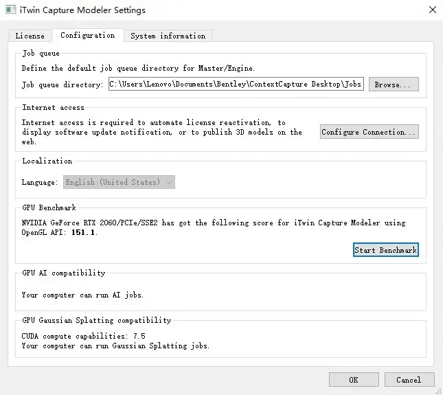

这里主要看三项。

- GPU Benchmark：确认 OpenGL 计算能够正常运行。跑分可以用于比较同一台机器前后的状态，不适合直接换算处理时间。
- GPU AI compatibility：检查显卡能否运行机器学习任务，例如自动色彩校正。
- GPU Gaussian Splatting compatibility：这次正射影像流程用不到。后续制作高斯泼溅成果时，再根据兼容性提示选择参数。

截图中的 RTX 2060 显示 CUDA Compute Capability 7.5。软件判定它可以运行高斯泼溅任务。这个结果只说明兼容性，不代表具体项目一定能流畅处理。

## 新建项目并导入照片

### 创建 Block 并导入照片

打开 Master，在右上角选择「New Capture → New Block」。

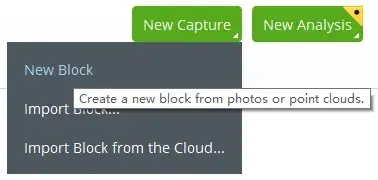

填写项目名称并选择保存位置。处理过程中会产生缓存和中间文件，保存位置应留出足够空间。

进入新建的 Block，打开「Photos」页签。选择「Add Photos → Add Entire Directory」。然后指定无人机照片所在的文件夹。

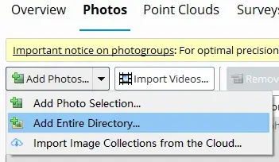

导入后，照片列表会显示相机型号、传感器尺寸、焦距和照片定位等元数据。软件通常可以识别常见无人机写入的 EXIF 信息，因此不必逐张填写。

### 检查照片文件

提交空三前，先检查照片能否正常读取。单击照片列表上方的「Check Image Files」。

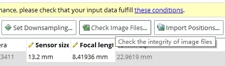

对话框提供两种检查方式。

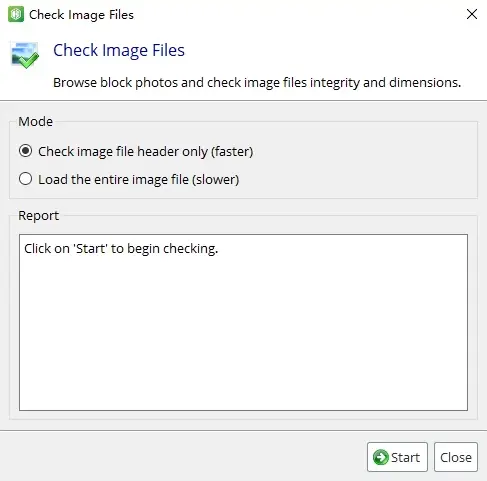

- 「Check image file header only」只读取文件头，速度较快，适合做初步筛查。
- 「Load the entire image file」会完整解码照片，耗时较长。照片经过复制、恢复或长时间存放，怀疑文件内容损坏时，可以使用这一项。

文件头检查通过，只能说明软件能够读取文件头，不能证明全部像素数据完整。这里先使用快速检查。结果为「N/N image files were successfully opened」。

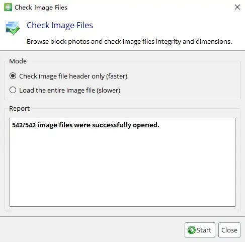

如果检查失败，应先处理损坏或路径失效的照片，再提交空三。照片能够打开，也不代表它一定能加入主连接体。模糊、重复、重叠不足和纹理过少等问题，仍可能导致匹配失败。

## 完成空三

空中三角测量（Aerotriangulation，AT；下文简称「空三」）用于建立照片之间的几何关系，并估计相机位姿。后续重建都以空三结果为基础。

在 Block 页面右上角单击「Submit Aerotriangulation」。软件随后打开 Aerotriangulation Definition 对话框。

### 选择本地或云端处理

提交时，软件会询问任务的处理位置。

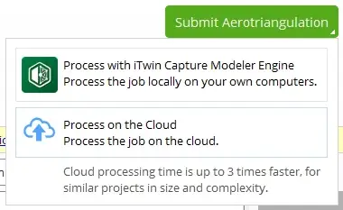

- 「Process with iTwin Capture Modeler Engine」使用本机处理。提交前应确认 Engine 已经启动。
- 「Process on the Cloud」使用 Bentley 云端资源，需要相应的服务和许可。

这里使用本地 Engine。

### 设置定位和地理参考

「Positioning/Georeferencing」页面用于设置地理参考。软件会根据这里的选项，使用照片定位、控制点或点云等数据。

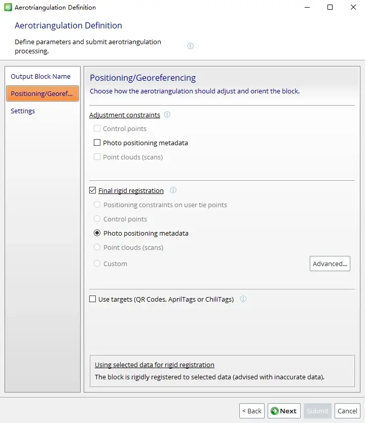

「Adjustment constraints」用于参与空三平差的高精度约束。可靠的 RTK/PPK 坐标、地面控制点或精确点云，可以放在这一组中。普通无人机照片中的原始定位通常不应当作为高精度约束。

「Final rigid registration」用于空三末期的整体配准。它会通过平移、旋转和统一比例缩放，将照片块放到目标位置。这组照片只有普通定位信息，因此选择「Photo positioning metadata」。这一步不会把普通 GNSS 数据变成高精度测量数据。

Bentley 对这两类约束有专门说明，详见[《iTwin Capture Modeler Aerotriangulation Settings》](https://bentleysystems.service-now.com/community?id=kb_article_view&sysparm_article=KB0041917)。

这组数据没有使用人工标靶，因此不启用「Use targets」。如果现场布设了软件支持的标靶，应按照实际采集方案设置。

### 设置空三策略

「Settings」页面控制位姿、连接点、相机参数和色彩校正等选项。

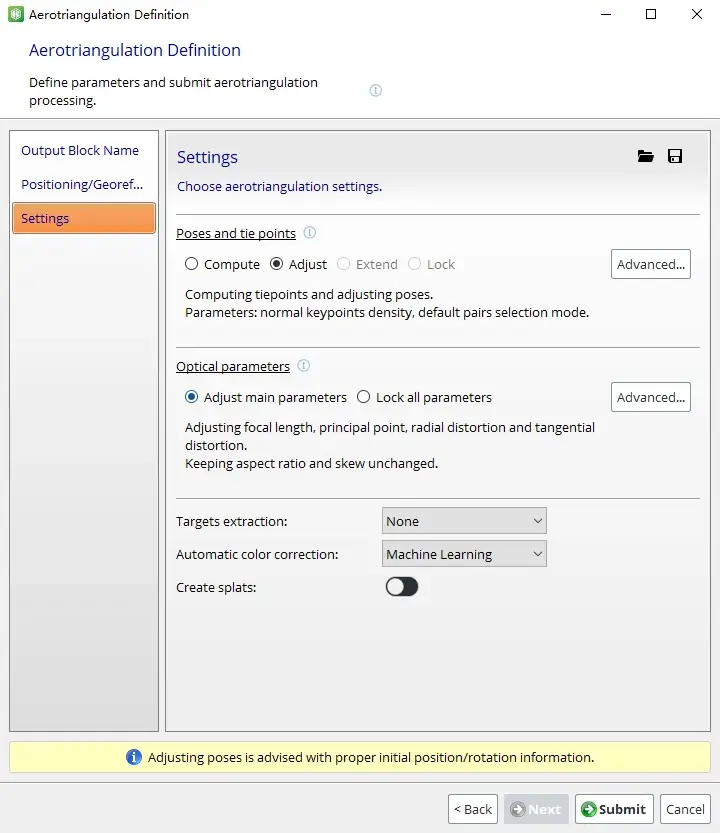

**（1）Poses and tie points**

照片带有完整的位置和方向信息，因此选择「Adjust」。四种策略的含义如下。

- Compute：重新计算照片位姿和连接点。照片定位是否参与最终地理配准，仍由前一页的设置决定。因此，Compute 不等于完全忽略 EXIF 定位。
- Adjust：以已有的完整位姿为基础，根据连接点进一步调整。照片同时具备位置和方向信息时，适合使用这一项。
- Extend：在已有空三结果上继续计算。它可以加入新照片、连接未进入主连接体的照片，或尝试合并分离的组件。Extend 依赖已有结果，不适用于首次计算。
- Lock：保留已有位姿和连接点，不再调整或重新计算。当前空三结果已经确认可用时，才考虑使用。

四种策略的详细说明见 Bentley 文档：[《Choosing the Right Strategy for Aerotriangulation》](https://bentleysystems.service-now.com/community?id=kb_article_view&sysparm_article=KB0043014)。

计算密度和配对模式先保留默认值。默认空三结果不理想时，再结合航线、重叠率和场景特征调整参数。

**（2）Optical parameters**

这里选择「Adjust main parameters」。软件会根据照片匹配结果，调整主要的相机内参数和畸变参数。没有经过专门标定的普通无人机相机可以先使用这一设置。

已经导入可靠的相机标定参数时，可以选择「Lock all parameters」。不应在没有标定依据的情况下，盲目锁定全部参数。

**（3）其他设置**

- Targets extraction：没有使用标靶，选择「None」。
- Automatic color correction：显卡支持 AI 任务时，可以选择「Machine Learning」。不支持时，可改用「Block-wise」或「Photogroup-wise」。
- Create splats：关闭。这次只生成正射影像，不创建高斯泼溅成果。

### 查看空三结果

空三完成后，Block 的 Overview 页签会显示统计信息。

原始照片目录共有 542 张。第一次计算后，照片没有全部连成一个主连接体。我重新检查并整理了照片集，后续截图使用 309 张照片的结果。这个处理适用于本项目，不应把「删除未连接照片」当成固定步骤。

遇到类似情况时，可以依次检查以下问题：

1. 照片是否来自不同航次或不连续区域。
2. 航向和旁向重叠是否足够。
3. 是否存在模糊、过曝、重复或纹理过少的照片。
4. 照片是否缺少完整的方向信息。
5. 能否使用「Extend」连接剩余照片或组件。

确认照片确实不属于目标范围，或者质量无法满足匹配要求后，再移除相应文件。

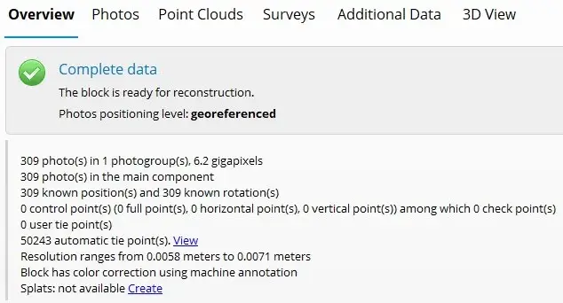

最终结果中的几个数字可以这样理解。

- 「Photos positioning level: georeferenced」表示 Block 已经放入地理参考框架。它不代表成果经过控制点验证。
- 「309 photo(s) in the main component」表示 309 张照片都进入主连接体。这是一个好现象，但不能单独证明空三质量合格。
- 「309 known position(s) and 309 known rotation(s)」表示每张照片都有位置和方向值。这里的「known」不等于「高精度」。
- 「50243 automatic tie point(s)」表示软件找到了 50,243 个自动连接点。连接点会同时出现在多张照片中，不能简单除以照片数来判断每张照片的质量。
- 「Resolution ranges from 0.0058 meters to 0.0071 meters」表示估算 GSD 为 5.8～7.1 mm。这个数值可用于选择输出像元尺寸，不代表绝对位置精度。
- 「Block has color correction using machine annotation」表示软件已经应用机器学习色彩校正。

用于浏览时，可以继续进入重建。用于测量时，还应检查重投影误差、控制点误差、独立检查点误差和局部变形。

## 建立 Orthomosaic 重建

空三完成后，Block 树中会出现一个带「- AT」后缀的节点。选中它，然后单击「New Reconstruction」。

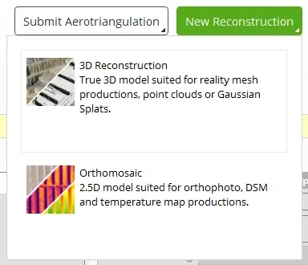

软件提供两种重建方式。

- 「3D Reconstruction」用于三维网格等成果。
- 「Orthomosaic」用于正射影像和 DSM。

这里选择「Orthomosaic」。新节点的默认名称类似 `Orthophoto/DSM_1`，主要参数位于「Spatial Framework」页签。

### 裁剪重建范围

软件会根据照片覆盖范围生成初始感兴趣区域（Region of Interest，ROI）。边缘照片常常包含无关区域。缩小 ROI 可以减少无效计算，并缩小输出范围。

单击左侧工具栏中的立方体按钮，编辑 ROI。

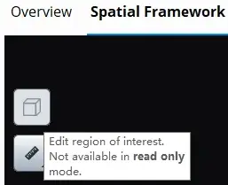

如果按钮提示「Not available in read only mode」，说明当前项目以只读方式打开。关闭项目，再使用可编辑方式重新打开。

这组数据是一段线状走廊。裁剪后，ROI 只保留需要的区域，不再使用覆盖全部照片的大矩形。

### 选择输出分辨率

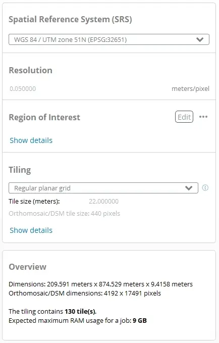

「Resolution」的单位是 m/pixel，表示一个输出像素对应的地面距离。GSD 则表示源照片中的一个像素对应多大的地面范围。选择输出分辨率时，应同时考虑以下因素：

- 源照片的有效 GSD；
- 影像清晰度和重叠质量；
- 成果用途；
- 输出尺寸和下游软件的承受能力。

这里还要区分像元尺寸和位置精度。像元尺寸影响影像细节和文件大小；位置精度取决于照片定位、控制点、平差质量和坐标基准。把 Resolution 调得更小，不会提高坐标精度。输出像元尺寸小于有效 GSD，也只会增加像素数量，不会凭空生成细节。

下面的取舍只适用于这组数据，不是通用标准。

| 像元尺寸 | 取舍 |
| --- | --- |
| 0.01 m/pixel | 接近源数据的 GSD，文件较大，适合检查局部细节 |
| 0.02 m/pixel | 保留较多细节，输出尺寸和计算量仍然较高 |
| 0.05 m/pixel | 文件较小，适合一般浏览、GIS 叠加和 CAD 辅助底图 |

2 cm 像元并不能保证看清设备铭牌或细小裂缝。能否识别具体目标，还取决于镜头、航高、快门、对焦、运动模糊和目标本身的尺寸。

这里选择 `0.05 m/pixel`。空三报告中的 GSD 为 5.8～7.1 mm，5 cm 像元约为原始 GSD 的 7～9 倍。用于浏览和制作辅助底图已经足够。

### 确认坐标系统

无人机照片通常以 WGS 84 经纬度记录位置。软件可以根据照片位置建议一个投影坐标系统，但这个结果不一定与工程图纸一致。

项目位于大庆附近。软件建议使用 `WGS 84 / UTM zone 51N (EPSG:32651)`。对于一般 GIS 叠加，这个坐标系统可以使用。导入 CAD 前，还要确认 CAD 图纸采用相同坐标系统。World File 只记录像素到平面坐标的仿射关系，不负责坐标系统转换。

UTM 每 6° 经度划分一个投影带。除经度 180° 的边界情况外，带号可以按下式计算：

$$
\text{UTM 带号}=\left\lfloor\frac{\text{经度}+180}{6}\right\rfloor+1
$$

大庆附近的经度约为东经 125°，计算结果为 51，因此属于 UTM 51N。

国内工程项目还可能使用 CGCS2000 高斯投影、地方独立坐标或施工坐标。此时应以项目坐标基准为准，不能因为软件自动选出了 UTM，就直接认为它能与现有图纸重合。

DSM 还涉及高程基准。照片中的 GNSS 高度、椭球高和工程使用的正常高不是同一个概念。需要使用 DSM 做高程分析时，应先确认垂直坐标系统和高程来源。

### 检查分块和内存预算

Tiling 使用「Regular planar grid」即可。Tile size 可以先保留软件给出的默认值。页面下方会显示 ROI 尺寸、输出像素尺寸、tile 数量和预计的单任务内存峰值。

本项目的主要数据如下。

| 项目 | 数值 |
| --- | --- |
| ROI 尺寸 | 209.591 × 874.529 × 9.4158 m |
| Orthomosaic/DSM 尺寸 | 4,192 × 17,491 px |
| Tile 数量 | 130 |
| 单任务最大内存预算 | 9 GB |

单任务最大内存预算应低于系统可用内存。数值过高时，可以减小 Tile size。这样能降低单个 tile 的峰值内存，但会增加 tile 数量。

## 设置 Production

完成 Spatial Framework 后，单击右上角的「Submit Production」。软件随后打开 Production Definition 对话框。

### 选择输出类型

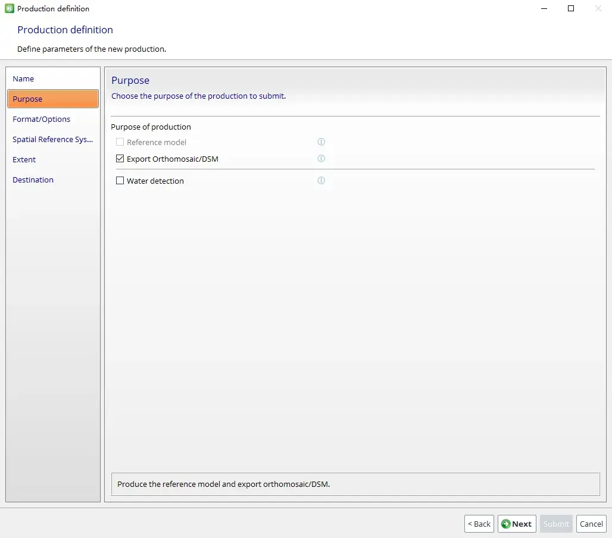

这里只勾选「Export Orthomosaic/DSM」。截图中的「Reference model」保持灰显默认状态，不据此判断重建是否完成。「Water detection」用于特定的水面处理，本文不启用。

### 设置格式和输出选项

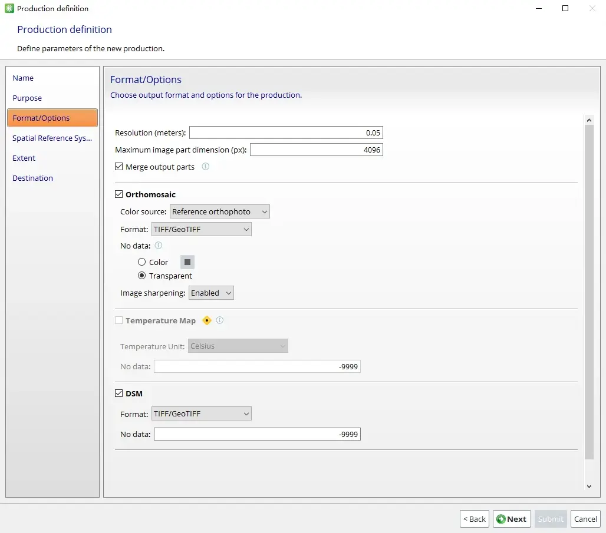

采用以下设置。

- Resolution：`0.05 m`，与 Spatial Framework 相同。
- Maximum image part dimension：`4096 px`。不合并输出时，它会限制单个分块的最大边长。
- Merge output parts：根据预计文件体积和下游软件兼容性决定，见下一小节。

Orthomosaic 部分：

- Color source：保留默认的「Reference orthophoto」。
- Format：选择「TIFF/GeoTIFF」。
- No data：选择「Transparent」。ROI 不是矩形时，透明背景比黑色填充更便于叠加。
- Image sharpening：这里启用，用于改善目视效果。后续要做严格的辐射分析时，应根据处理要求决定是否关闭。

Temperature Map 不勾选，因为这组数据不包含热成像照片。

DSM 部分：

- Format：选择「TIFF/GeoTIFF」。
- No data：保留 `-9999`。下游软件应根据栅格的 NoData 元数据识别空值，不要把它当成真实高程。

### 估算输出体积

合并文件的未压缩体积可以按整幅影像估算。

$$
\text{体积}=\text{宽度}\times\text{高度}\times\text{波段数}\times\text{每个样本的字节数}
$$

除以 1,048,576 后，单位为 MiB。

输出尺寸为 4,192 × 17,491 px。若正射影像使用 RGBA 四波段，每个样本占 1 字节，未压缩体积约为 280 MiB。DSM 使用单波段 Float32，每个样本占 4 字节，未压缩体积也约为 280 MiB。两者合计约为 560 MiB。

实际占用还会受到压缩方式、影像内容、透明区域、金字塔和中间文件影响。LZW 对连续色调航片的压缩效果并不固定，因此不宜使用一个统一压缩率推算最终文件大小。

「Maximum image part dimension」用于控制分块边长。勾选合并后，最终文件大小仍由整幅影像的宽度、高度、波段和数据类型决定。

### 决定是否合并分块

是否勾选「Merge output parts」，主要看两个条件：

1. 合并后的 TIFF 是否会接近普通 TIFF 的约 4 GiB 限制。
2. 目标软件是否支持 BigTIFF 和大尺寸栅格。

BigTIFF 可以保存超过 4 GiB 的 TIFF，但部分 CAD 工作流不支持这种格式。准备在 AutoCAD 中使用时，如果合并文件可能过大，应保留分块输出。Autodesk 对此有专门说明，详见[《Loading a GeoTIFF in AutoCAD Map 3D or Civil 3D fails》](https://www.autodesk.com/support/technical/article/caas/sfdcarticles/sfdcarticles/Prequisites-GeoTIFFs-as-DEM-not-documented.html)。

估算结果显示，正射影像和 DSM 都远低于 4 GiB。因此，这里勾选「Merge output parts」。这只是本文项目的选择，不是固定阈值。

### 设置输出坐标系统

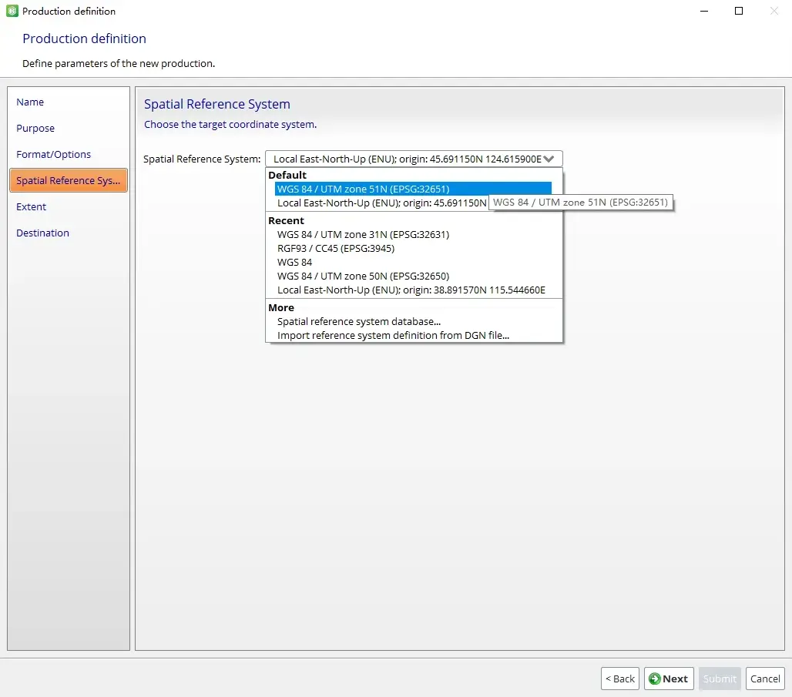

下拉框中可能出现「Local East-North-Up (ENU)」。局部 ENU 适合局部建模，但不便于与采用公共坐标系统的 GIS 或 CAD 数据交换。这里不选它。

Production 可以有意输出到另一个坐标系统。软件不要求它与 Spatial Framework 完全相同。这个项目不需要转换坐标系统，因此仍选择 `WGS 84 / UTM zone 51N (EPSG:32651)`。

「Extent」保留全部 tile。「Destination」使用项目目录下的默认 Production 文件夹。

## 提交任务并检查输出文件

参数确认后，单击「Submit」。

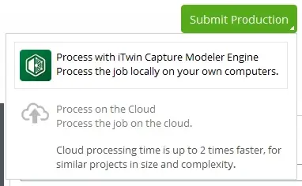

这里选择「Process with iTwin Capture Modeler Engine」。提交前确认 Engine 正在运行。任务完成后，Production 节点会显示「Completed」。

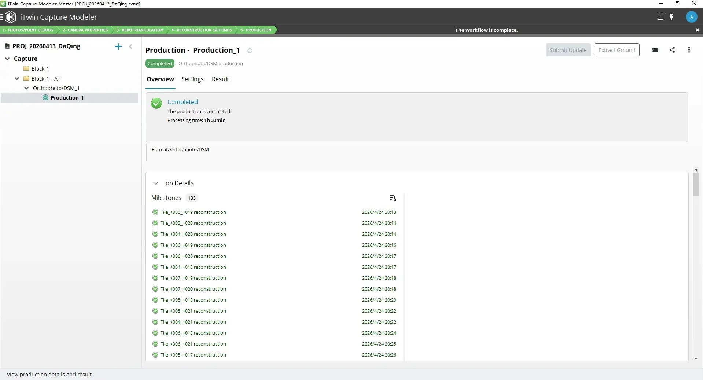

打开 Production 目录，可以看到正射影像、DSM 和分块中间文件。

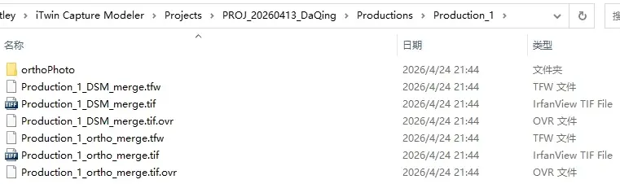

```text
Production_1/
├── Production_1_ortho_merge.tif
├── Production_1_ortho_merge.tfw
├── Production_1_ortho_merge.tif.ovr
├── Production_1_DSM_merge.tif
├── Production_1_DSM_merge.tfw
├── Production_1_DSM_merge.tif.ovr
└── orthoPhoto/
```

这些文件的作用如下。

- `.tif`：GeoTIFF 主文件，可在内部保存坐标系统和地理参考信息，是必须保留的成果文件。
- `.tfw`：World File。它记录像素与平面坐标之间的仿射变换，主要用于兼容依赖外部配准文件的软件和脚本。后续使用的 INSGEO 需要同名 `.tfw`。
- `.tif.ovr`：外部金字塔文件，用于加快缩放和浏览。删除后通常可以重新生成，不影响主文件中的像素和坐标信息。

只在 GIS 软件中使用时，GeoTIFF 主文件通常可以正确定位。使用 INSGEO 导入 AutoCAD 时，应同时保留 `.tif` 和同名 `.tfw`。`.ovr` 建议一并保存，但它不是配准所必需的文件。

## 使用输出成果

### 导入 AutoCAD

将正射影像和同名 World File 放在同一目录，然后使用 [INSGEO](/insgeo-autocad-georeferenced-images/) 导入。脚本会读取 `.tfw`，按照其中的仿射参数放置影像。

World File 不包含完整的坐标系统转换信息。影像使用 UTM 51N，而图纸使用地方坐标时，两者不会自动重合。导入前应先统一坐标系统，或准备可靠的坐标转换参数。

没有合并分块时，INSGEO 也可以批量导入多张影像。团队协作、共享路径和 ETRANSMIT 打包方法，见 [INSGEO 文章](/insgeo-autocad-georeferenced-images/)。

### 导入奥维互动地图

奥维互动地图可以导入 TIFF 航拍图。输出成果应使用软件能够识别的公共坐标系统。不要使用只在项目内部有意义的 Local ENU。

具体操作可参考奥维官方文档：

- [《如何导入 TIFF 格式的航拍图》](https://www.ovital.com/134111-2/)
- [《手机端如何导入 TIFF 格式航拍图》](https://www.ovital.com/138654-2/)

大文件加载较慢时，可以先在 GIS 软件中裁剪、重采样或切片，再导入奥维。

### 导入 GIS 软件

QGIS、ArcGIS Pro 和 Global Mapper 等 GIS 软件都能读取 GeoTIFF 的地理参考信息。添加 `.tif` 栅格图层后，应先检查以下内容：

- 坐标系统是否识别正确；
- 影像范围是否落在预期位置；
- NoData 区域是否透明；
- 与已知底图或控制数据是否存在整体偏移。

需要压缩或转换格式时，应根据接收方软件选择格式。常见格式包括 GeoTIFF、JPEG 2000、ECW 和 MBTiles。压缩比例和画质取决于编码参数与影像内容，不宜预先承诺固定比例。

### 使用 DSM

DSM 表示可见地表，通常包含建筑物、树木、车辆和其他地物。它适合查看地表起伏，也可以用于坡度、坡向等分析。

要提取真实地面高程，需要先进行地面点分类。然后生成数字地形模型（Digital Terrain Model，DTM）。生成等高线或计算土方前，还要确认垂直基准和成果精度。没有这些步骤，不应直接把 DSM 用于土方结算。

---

*本文采用 [CC BY-NC-SA 4.0](https://creativecommons.org/licenses/by-nc-sa/4.0/deed.zh) 协议发布，可自由转载、修改，但需保留作者署名、不可用于商业用途、衍生作品需以相同协议发布。*
