[上一篇](/itwin-capture-modeler-orthophoto/)用 iTwin Capture Modeler 从无人机照片生成了正射影像和 DSM。这一篇继续使用同一套软件，不过目标换成三维模型。

这里没有继续使用上一篇的大疆航拍数据，而是采用 Bentley Quickstart Exercise 里的一个小型变电站项目：66 张照片、17 个控制点，照片本身没有可用的地理定位信息。这个数据集规模不大，却很适合观察一个摄影测量模型怎样从「只有内部相对几何」一步步进入真实坐标系。

整条主线可以概括成四步：

1. 先做一次没有外部地理参考的空三，建立照片之间的相对摄影测量网络；
2. 导入 17 个控制点，并把它们和照片里的像点对应起来；
3. 让控制点参与下一次空三，把模型约束到真实坐标系；
4. 基于空三结果建立 3D Reconstruction，输出 3SM 三维模型。

这里之所以会出现两次空三，是这套教学数据和具体操作路径共同造成的，并不是「用了控制点就必须空三两次」。iTwin Capture Modeler 本身允许在第一次空三前就添加控制点。先得到一个相对空三结果的好处，是照片之间已经有了可用的几何关系，后续点刺时更容易筛选照片并使用核线辅助。对于已经有可靠照片位姿、或者能够直接完成控制点点刺的项目，完全可以采用不同的空三策略。

飞行前的 GSD、重叠度、倾斜航线和控制点布设原则已经在 [《消费级无人机怎么做三维建模和正射影像》](/consumer-drone-photogrammetry-flight-planning/) 里集中整理，这篇只讨论照片进入 iTwin Capture Modeler 之后的处理。

[TOC]

## 导入照片

打开 Master，右上角选择「New Capture → New Block」，然后在新 Block 的「Photos」页签中选择「Add Photos → Add Entire Directory」，把 Quickstart Exercise 的 66 张照片全部导入。

这一批照片和上一篇的数据有一个关键区别：没有可用于地理参考的照片位置。因此第一次空三先不尝试把模型放进真实坐标系，只恢复照片之间的相对几何。

## 第一次空三：先建立相对摄影测量网络

第一次空三的目标不是得到最终成果，而是先回答一个更基础的问题：这些照片彼此是什么关系？

仅靠重叠照片中的连接点，摄影测量就可以恢复一套内部一致的三维结构和相机位姿。此时模型已经「成形」，但如果没有已知坐标、尺度或方向的外部信息，整体仍然可以做平移、旋转和统一尺度变化。这就是后面结果里 `relative` 的含义。

在 Block 页面右上角选择「Submit Aerotriangulation」。

### Positioning/Georeferencing

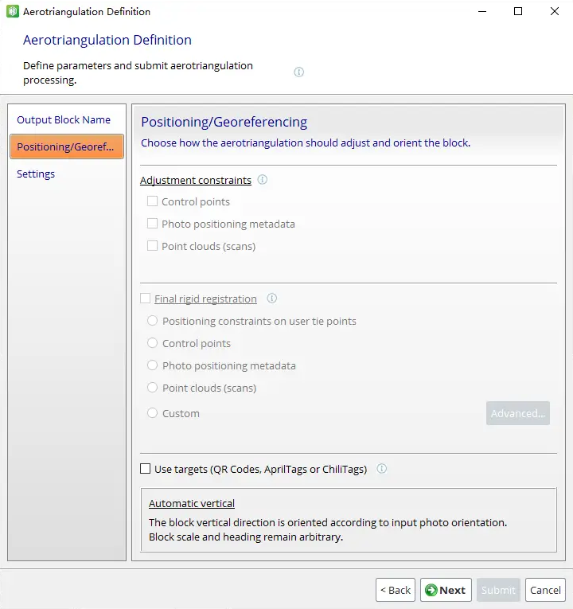

这一步没有可用的照片定位、点云或控制点，因此「Adjustment constraints」全部不选，「Final rigid registration」也不使用。

界面下方提示：

> Automatic vertical: The block vertical direction is oriented according to input photo orientation. Block scale and heading remain arbitrary.

这里最值得注意的是后半句：Block 的尺度和朝向仍然是任意的。软件可以根据照片本身恢复内部几何，但此时还没有任何真实坐标意义。

「Use targets」保持关闭。本数据集的控制点需要后续人工点刺，并没有使用可自动识别的 AprilTag、ChiliTag 等标靶。

### Settings

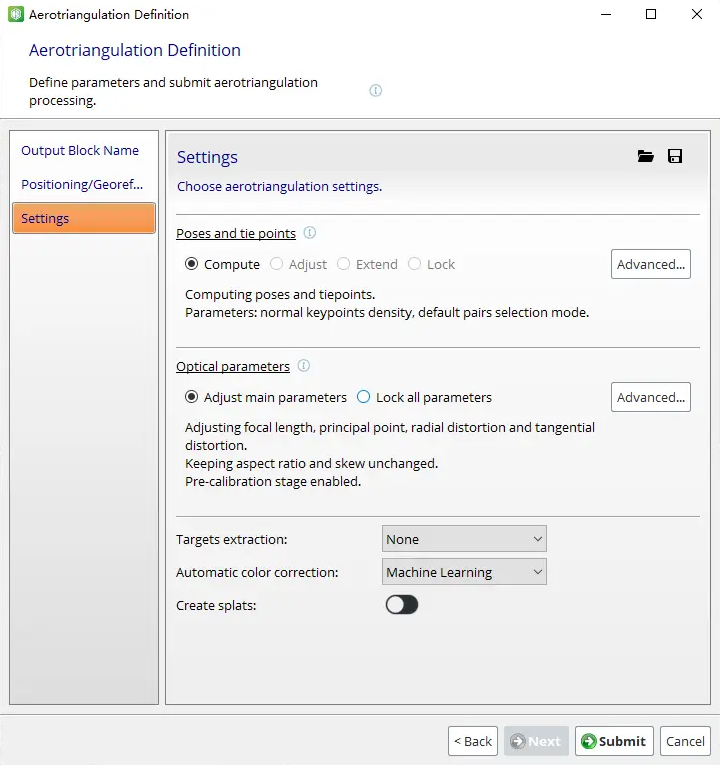

「Poses and tie points」选择「Compute」。Bentley 当前对这个选项的定义是：重新计算相机位姿和连接点，不沿用已有 pose information。它适合照片位姿缺失、不完整或不可靠的情况；这组照片正属于这一类。

这里有一个容易和上一篇混淆的地方：有没有 EXIF GPS，并不能单独决定应该选「Compute」还是「Adjust」。当前的「Adjust」要求照片已经具有完整的 position 和 orientation，可以在现有 pose 基础上进一步调整；如果只有位置而没有完整姿态，仍然可能需要「Compute」。因此实际项目应先看照片位姿信息是否完整，而不是简单套用「有 GPS 就 Adjust、没 GPS 就 Compute」。

「Optical parameters」在本例中选择「Adjust main parameters」。这一项控制的是相机内部参数，而不是相机在空间里的位置。空三除了计算相机位姿，也可能根据照片网络调整焦距、主点和镜头畸变等参数。截图中还显示「Pre-calibration stage enabled」，说明软件会先进行预标定。Bentley 当前的建议是：如果已经有可靠的相机标定或数据库光学参数，应优先从这些初值开始；初始光学参数未知或不可靠时，再启用预标定和相应的调整。

其余参数按本例保持默认：「Targets extraction」为 None，「Automatic color correction」为 Machine Learning，「Create splats」关闭。

确认 Engine 已经运行后提交处理。

### 第一次空三的结果

完成后，Block 树中会出现新的 AT 节点。Overview 页签显示：

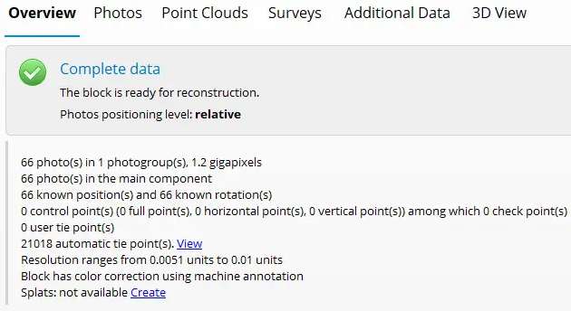

这一页最重要的不是连接点有多少，而是下面两个变化：

- 「Photos positioning level: relative」：照片之间已经建立相对位置和姿态，但整体还没有真实地理位置、朝向和尺度；
- 「Resolution ranges from 0.0051 units to 0.01 units」：单位还是 `units`，而不是 `meters`，说明当前结果没有真实物理尺度。

66 张照片全部进入 main component，说明照片网络连接正常。此时模型已经足够用于后续控制点点刺，但它仍然只是一个相对摄影测量模型。

## 导入控制点

控制点的作用，可以拆成两部分理解。

一部分是现实世界中的已知坐标：某个点真实的 $X,Y,Z$ 是多少；另一部分是影像观测：这个已知空间点在不同照片里分别落在哪个像素位置。只有把这两部分对应起来，控制点才能进入摄影测量平差。

Bentley Quickstart Exercise 提供了一份 `GCPs.txt`，其中有 17 个点：

```text
Name Easting Northing Elevation
gps10 1830932.439 4230780.088 407.353
plaque5 1830938.821 4230784.985 404.432
plaque4 1830953.579 4230790.569 404.441
gps9 1830971.335 4230804.956 399.554
plaque3 1830966.416 4230837.713 399.521
gps8 1830962.664 4230826.983 399.536
gps7 1830962.271 4230837.843 399.473
gps6 1830947.882 4230833.182 402.280
gps5 1830954.754 4230819.022 402.610
plaque.grise2 1830961.597 4230811.162 403.004
plaque.grise1 1830955.360 4230808.385 403.671
gps04 1830961.632 4230806.238 403.129
plaque2 1830937.041 4230816.126 404.477
plaque1 1830935.715 4230825.417 404.409
GPS0003 1830941.677 4230828.782 404.311
GPS0002 1830947.628 4230804.183 404.422
GPS0001 1830948.700 4230789.177 404.455
```

这里能从文件本身确定的只是点名、Easting、Northing 和 Elevation 四列。不要仅凭坐标数值的数量级猜测坐标参考系；坐标文件本身并不会自动携带完整 CRS 语义，正式项目应该从测量成果说明或数据提供方确认。

本教学数据指定的平面坐标系是 RGF93 / CC45（EPSG:3945）。

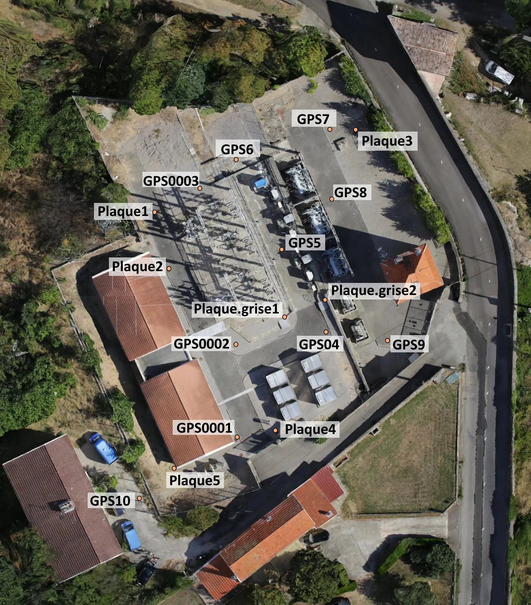

图中 17 个点覆盖了场地外围和内部。这里不把这套分布直接概括成「四角加中心」之类固定规则；真实项目的控制点数量和位置应结合测区形状、高差、航摄几何和精度要求设计。

### 用向导导入

切到第一次空三结果的「Surveys」页签，在「Survey Points」中选择「Add」旁边的下拉菜单，然后进入「Import Surveys → Custom Text Format (Wizard)」。

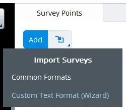

#### File Format

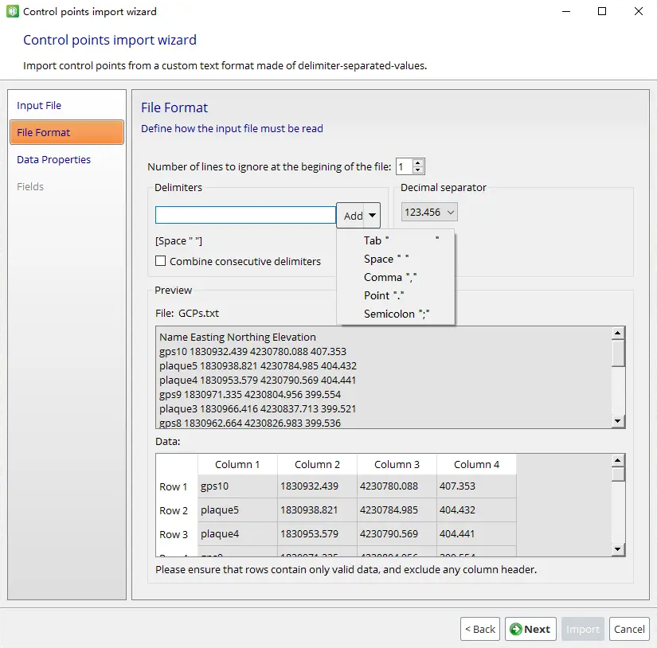

这份文件第一行是表头，因此「Number of lines to ignore at the beginning of the file」设为 `1`。

数据使用空格分隔，所以 Delimiter 选择 Space。小数使用点号，Decimal separator 保持 `123.456`。下方 Preview 能正确分成 4 列，就说明文本格式解析正常。

#### Data Properties

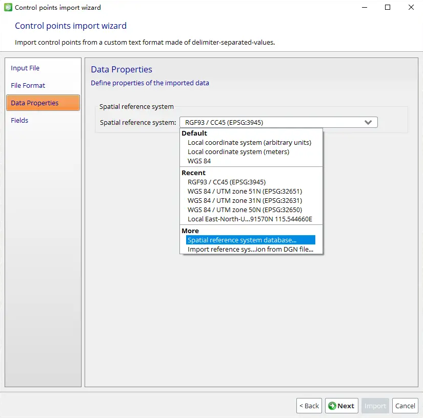

「Spatial reference system」选择数据提供方指定的 RGF93 / CC45（EPSG:3945）。

这里最重要的原则不是记住 EPSG:3945，而是：导入 Survey Points 时使用的 CRS 必须与控制点坐标本身一致。如果项目使用 CGCS2000、高斯—克吕格、UTM 或地方独立坐标系，就应选择对应的定义，不能根据数值「看起来像某种投影」来猜。

#### Fields

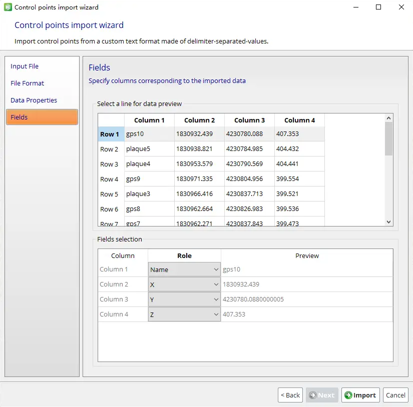

四列分别指定为：

- Column 1 → Name；
- Column 2 → X，对应 Easting；
- Column 3 → Y，对应 Northing；
- Column 4 → Z，对应 Elevation。

这里要留意不同专业软件对 X/Y 的习惯并不完全一致。iTwin Capture Modeler 的字段映射按投影坐标的 Easting → X、Northing → Y 处理，不要机械套用某些工程图纸里「X 为北向、Y 为东向」的书写习惯。

导入后，17 个 Survey Points 会出现在右侧列表中。此时软件只知道它们的坐标，还不知道这些点分别位于哪些照片的哪个像素位置。

## 在照片中点刺控制点

点刺的本质，是把控制点的对象空间坐标和影像空间观测连接起来。

工作流很简单：在右侧选择一个控制点，在能看到它的照片中精确点击对应位置，再选择「Accept Position」。同一个控制点需要在多张照片中重复完成这个操作。

### 为什么至少要多张照片

第一次只在一张照片中放置位置时，软件会提示：

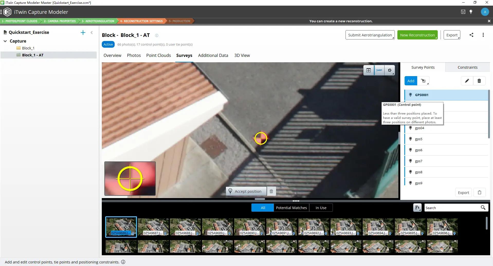

> Less than three positions placed. To have a valid survey point, place at least three positions on different photos.

这是 iTwin Capture Modeler 在这个工作流中的有效性要求：一个 Survey Point 至少需要 3 个不同照片位置。

从摄影测量几何上说，两幅影像在理想情况下已经可以做空间交会，但增加独立观测能够提供冗余，也更容易发现或减弱单次点刺误差。因此不应把「3 张」理解成所有多视几何问题的普适定律，它首先是当前软件对有效 Survey Point 的要求。

### 核线为什么能帮助找点

当一个控制点已经在几张照片中被标记后，其他照片里会出现橙色的核线：

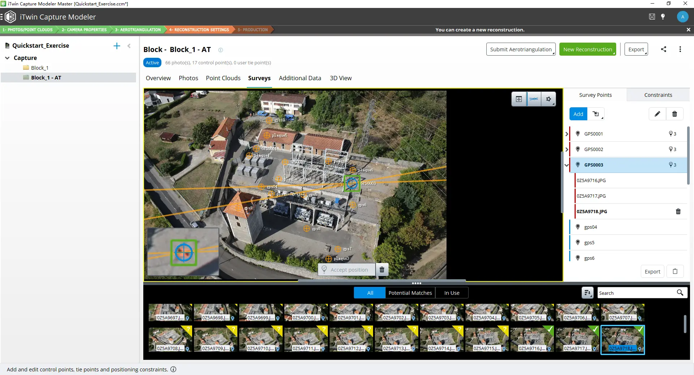

核线约束把「这个点可能在整张照片的哪里」缩小到了「它应该位于这条线上」。在照片数量较多、控制点本身又很小的时候，这个辅助非常实用。

合理的视角差异通常有利于空间交会稳定性。如果所有观测都来自几乎相同的方向，即使点了很多张，深度方向的几何仍然可能偏弱；但视角差异也不是越大越好，差异过大时目标外观和遮挡关系可能发生明显变化。实际点刺时，选择能清楚识别目标、同时具有一定几何差异的照片更合适。

### 几个操作细节

底部缩略图中的「Potential Matches」可以根据已有摄影测量几何筛选可能看到当前控制点的照片。这也是本例先做一次相对空三的实际价值：没有照片 GPS，也仍然可以借助已经建立的相对网络减少人工翻图。

右下角的放大窗口用于精确落点。控制点观测最好落在标志中心或定义明确的几何位置，而不是「差不多点在标志附近」。如果一个像素在地面已经对应数厘米，连续偏几个像素就会直接进入控制观测误差。

每次确认位置后选择「Accept Position」。至于一个控制点究竟应点 3 张、5 张还是更多照片，没有一个固定的「越多越准」公式；清晰、分布合理、彼此独立的观测比单纯增加数量更重要。

## 第二次空三：把模型带入真实坐标系

控制点完成点刺以后，再次选择「Submit Aerotriangulation」。这一次已经有两类信息：第一次空三得到的相机位姿和连接点，以及具有真实坐标的控制点观测。

### Positioning/Georeferencing

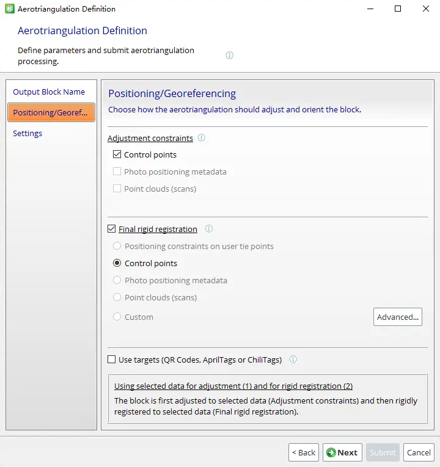

Bentley Quickstart 的截图中，「Control points」同时出现在 Adjustment constraints 和 Final rigid registration 中。这个界面本身很好地展示了两类 georeferencing 机制的区别，但不适合直接总结成「控制点必须做硬约束 + 再做一次刚体配准」。

按 Bentley 当前的通用说明：

- 高精度数据适合用作 Adjustment constraint，它会参与空三中间阶段，并能够影响照片连接和 Block 几何；
- Final rigid registration 用于最终的整体平移、旋转和统一尺度配准，不改变 Block 内部连接关系；
- 如果项目只有一种高精度地理参考来源，而且它已经作为 Adjustment constraint 使用，后端也会用它完成最终 scene registration，通常没有必要再把同一数据源重复指定为 Final rigid registration。

控制点通常属于前一类，因此处理自己的项目时，不建议把截图里的「两处都选 Control points」机械复制成固定模板。近似控制点、普通照片 GNSS、RTK/PPK 位置和多种约束同时存在时，应该根据各自的精度和一致性决定放在哪一层。

如果只是复现 Bentley Quickstart Exercise，可以按原教程截图操作；理解这一步时，应把重点放在「控制点参与摄影测量解算并建立地理参考」，而不是把 UI 的两组选项反推成一种普遍的双层数学规则。

### Settings

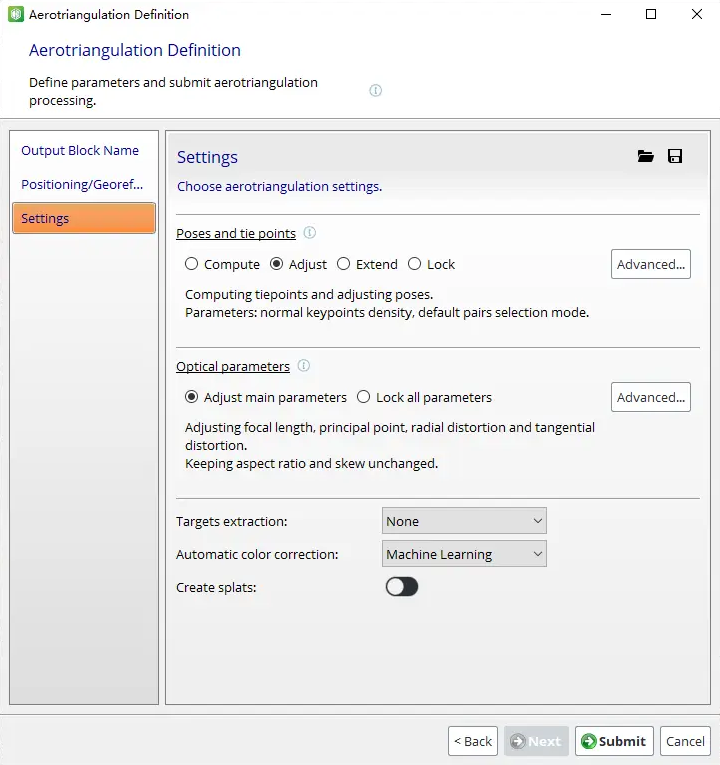

本例已经有第一次空三产生的完整相机位姿，因此「Poses and tie points」选择「Adjust」，在已有结果上继续调整。

这里同样不能推广成「有 EXIF GPS 的项目都选 Adjust」。Bentley 当前文档明确要求：只有 position 和 orientation 都完整时，「Adjust」才可用于当前 poses；如果照片只有位置而没有完整方向，通常还是要根据数据情况使用「Compute」。有 GCP 的项目是否需要第一次相对空三、最终使用哪种 pose policy，应由输入数据决定。

「Optical parameters」继续允许软件调整主要参数即可。只有已经有可靠相机标定、并明确希望保持这些参数不变时，才适合考虑「Lock all parameters」。不应因为第一次空三「看起来不错」就默认把镜头参数全部锁住。

### 第二次空三的结果

完成后，Overview 显示：

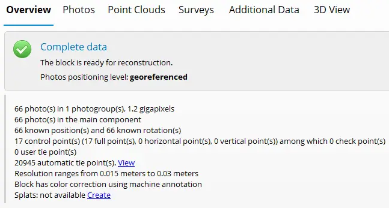

这一次有三个值得注意的变化：

- 「Photos positioning level: georeferenced」：模型已经进入真实坐标参考框架；
- Resolution 的单位变成 meters：模型具有真实物理尺度；
- 17 个 control points 被使用，同时显示 0 check points。

前两项证明模型已经完成地理参考，但不能据此直接宣布模型具有厘米级绝对精度。Resolution 描述的是影像/重建相关的空间采样尺度；`georeferenced` 说明真实位置、尺度和方向已经建立。绝对精度还取决于控制点测量质量、点刺误差、摄影测量网络以及是否有独立检查数据。

### Control Point 和 Check Point 不要混在一起

Overview 里还会看到 full、horizontal、vertical、check 等分类：

- Full point：X、Y、Z 都作为控制信息；
- Horizontal point：只使用平面坐标；
- Vertical point：只使用高程；
- Check point：具有已知坐标和影像观测，但不参与模型拟合，用来做独立检查。

控制点残差回答的是「模型多好地满足了用于平差的控制数据」；检查点误差则提供独立于平差之外的验证信息。二者都重要，但角色不同。

这套 Quickstart 数据的结果是「17 control points / 0 check points」。它足以演示控制点如何把相对模型引入真实坐标系，却不适合单凭这 17 个参与平差的点去宣称模型的独立绝对精度。

实际项目如果需要报告精度，应提前保留具有代表性的独立检查点，并尽量覆盖不同位置和高程。具体数量不能机械套用「17 个点留 1～2 个」这样的比例；有限检查点反映的也只是这些位置上的独立误差表现，不自动代表整个测区任意位置都具有同样精度。

## 建立 3D Reconstruction

在第二次空三结果上选择「New Reconstruction → 3D Reconstruction」，进入新的 Reconstruction 节点。

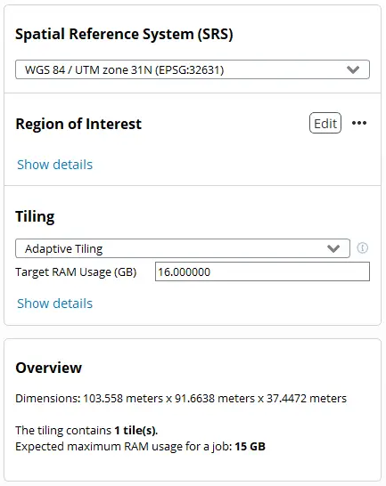

### Spatial Reference System

本例在 Spatial Framework 中选择 WGS 84 / UTM zone 31N（EPSG:32631），而控制点导入时使用的是 RGF93 / CC45（EPSG:3945）。两者不同并不矛盾：输入控制数据可以使用它自己的 CRS，重建框架和输出成果也可以选择另一个受支持的 CRS，软件负责坐标转换。

真正重要的是每一套坐标的定义都正确。不要因为模型位于法国就凭经验猜一个投影，也不要在国内项目里仅凭经度套一个 UTM 带后就认为完成了工程坐标配置。如果项目交付使用 CGCS2000、地方独立坐标系或特定中央经线的高斯—克吕格投影，重建和输出都应服从实际工程要求。

如果确实需要由经度判断 WGS 84 / UTM 分带，常见公式是：

$$
zone=\left\lfloor\frac{\lambda+180}{6}\right\rfloor+1
$$

其中 $\lambda$ 是经度。这个公式与上一篇保持一致；不要改写成 `ceil((经度 + 180) / 6)`，两者在分带边界上并不等价。

### Region of Interest

选择「Edit」进入 3D ROI：

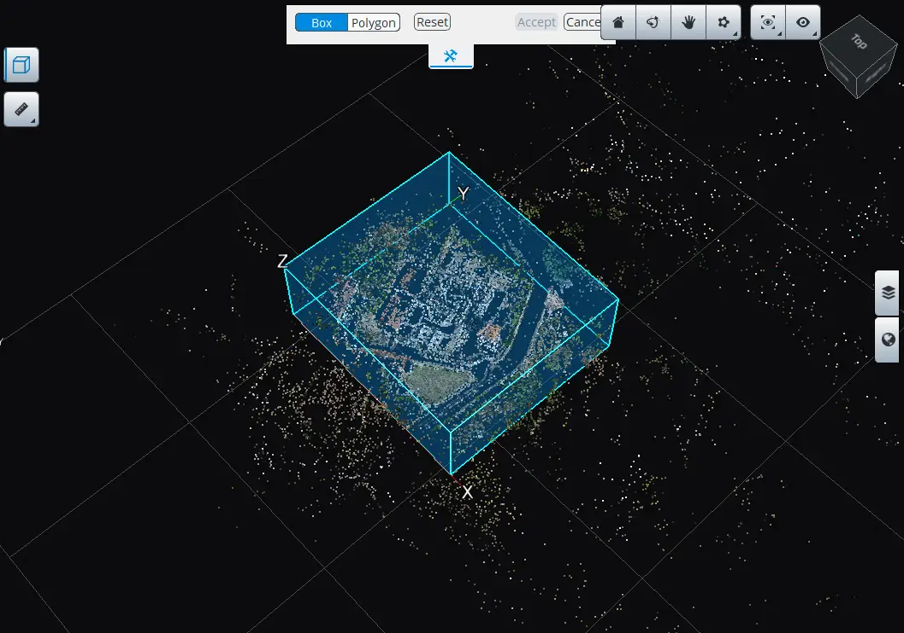

蓝色稀疏点云来自空三连接点，可以用来判断真正需要重建的范围。「Box」模式使用三维包围盒裁切；「Polygon」适合不规则平面区域，并另外设置高度范围。

这和上一篇 Orthomosaic 的二维 ROI 不同：3D Reconstruction 还需要考虑 Z 方向。适当缩小 ROI 一般可以减少需要处理的场景内容，但实际计算量还受到照片数量、可见关系、几何复杂度和分块方式等因素影响，不能简单认为处理时间与 ROI 体积严格成正比。

边界也不宜贴得过紧。摄影测量数据在采集边缘通常观测冗余较少，给最终关心区域留一点上下文，有利于避免直接把重建边缘当成可交付边界。具体留多少应看影像覆盖，而不是固定套用 5 m 或 10 m。

### Tiling

本例选择「Adaptive Tiling」，Target RAM Usage 设为 16 GB。截图中的 ROI 大约为 103.6 × 91.7 × 37.4 m，最终只包含 1 个 tile，预计单任务最大内存约 15 GB。

Adaptive Tiling 适合这类三维场景，但它不是所有 3D 项目的固定答案。更大的项目需要结合机器内存、场景范围和目标输出重新决定分块策略。本数据集只有 66 张照片，主要价值在于说明流程，不适合拿它的 tile 数量或处理速度去预测真实工程项目。

## 输出 3SM 三维模型

Spatial Framework 设置完成后选择「Submit Production」。

### Purpose

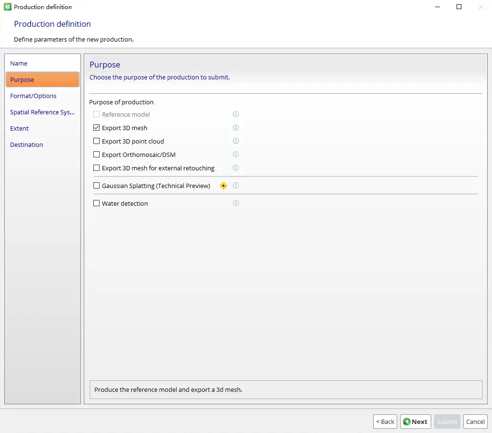

本文主线只选择「Export 3D mesh」。点云、Orthomosaic/DSM、外部修模以及 Gaussian Splatting 都是另外的成果类型，需要时可以基于同一个 Reconstruction 或 Block 再提交相应 Production，没有必要在这里一次全部勾上。

### Format / Options

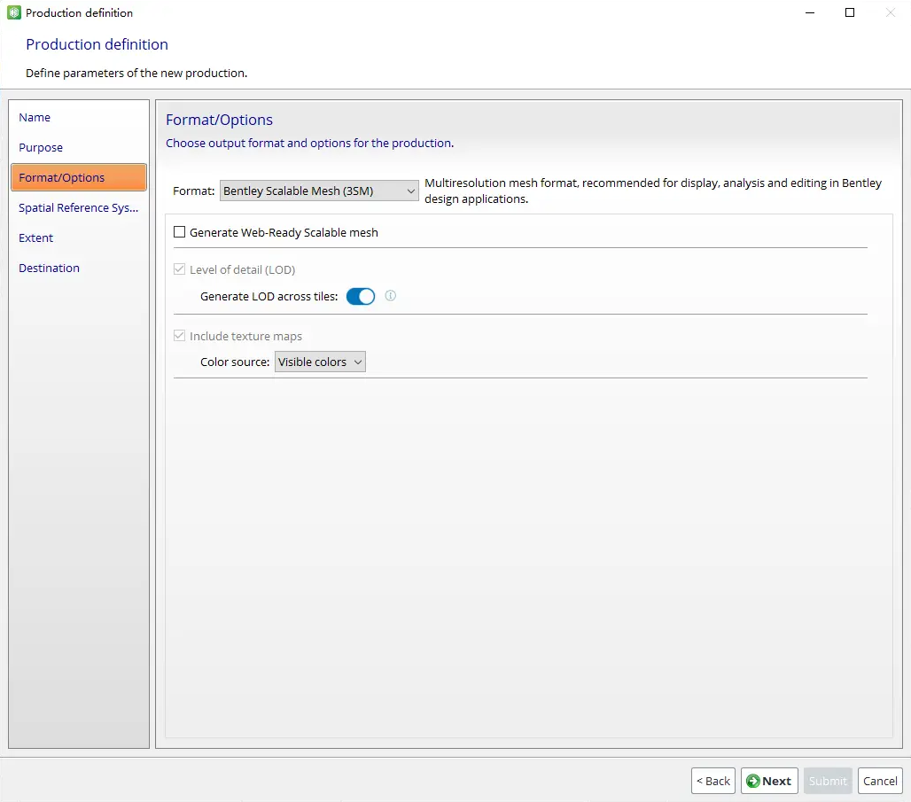

Format 选择 Bentley Scalable Mesh（3SM）。Bentley 从 iTwin Capture Modeler 2024 起把 3SM 作为 Bentley design applications 的默认和推荐三维网格格式，因此这篇把它作为主输出。

截图里的其他参数按本例保留即可。「Generate LOD across tiles」用于生成跨 tile 的多层次细节结构；本项目只有一个 tile，因此它的影响并不明显。

「Generate Web-Ready Scalable mesh」是否打开要看后续用途。本文只是本地用 iTwin Capture Desktop Viewer 查看，因此不依赖 Web-Ready 输出；如果要发布到 Reality Management / iTwin，应按当前 Bentley 的发布工作流选择 Web-Ready 或 iTwin Ready 相关输出，不需要沿用本文这张本地示例截图。

### 水平坐标和垂直基准要分开看

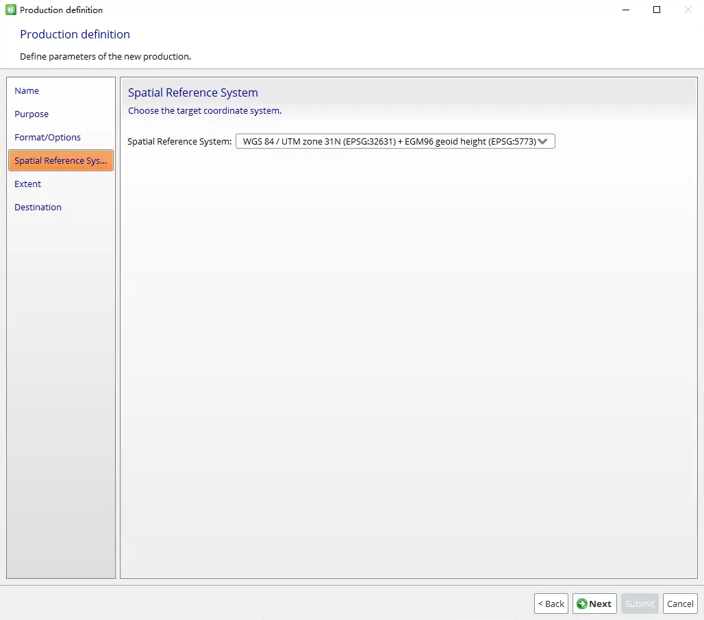

截图中 Production SRS 选择的是：

`WGS 84 / UTM zone 31N (EPSG:32631) + EGM96 geoid height (EPSG:5773)`。

这张图最值得讲的不是「所有项目都应该加 EGM96」，而是三维成果同时存在水平坐标和垂直坐标两个问题。

EPSG:32631 描述平面位置；EPSG:5773 描述 EGM96 geoid-related height。是否应该采用这套垂直基准，取决于输入控制点的 Elevation 到底是什么高度，以及最终成果需要与什么工程数据对接。

不能把 EGM96 height 直接等同于中国工程中的 1985 国家高程基准或正常高体系，也不能认为「UTM 后面加一个 EGM96」就自动变成国内通用工程高程。对于实际项目，应从测量成果说明中确认控制点 Z 的垂直基准，并让输出 VCS 与交付数据保持一致。

这套 Quickstart 的截图采用了 EGM96 组合坐标系，因此复现教学流程时可以按截图设置；但如果源数据说明没有明确告诉你 `GCPs.txt` 中 Elevation 的垂直基准，就不应仅凭高程数值自行推断。对三维模型来说，垂直基准错几十米并不会影响局部网格「看起来像不像」，却会在与工程模型、测量点或其他高程数据叠加时直接暴露出来。

上一篇的 Orthomosaic 也不是完全不涉及 Z：正射纠正依赖场景表面，DSM 更直接记录高程。只是三维模型与其他工程数据叠加时，高程基准不一致往往更容易被察觉。

### 提交 Production

其余 Extent 和 Destination 按项目需要设置后提交。完成状态如下：

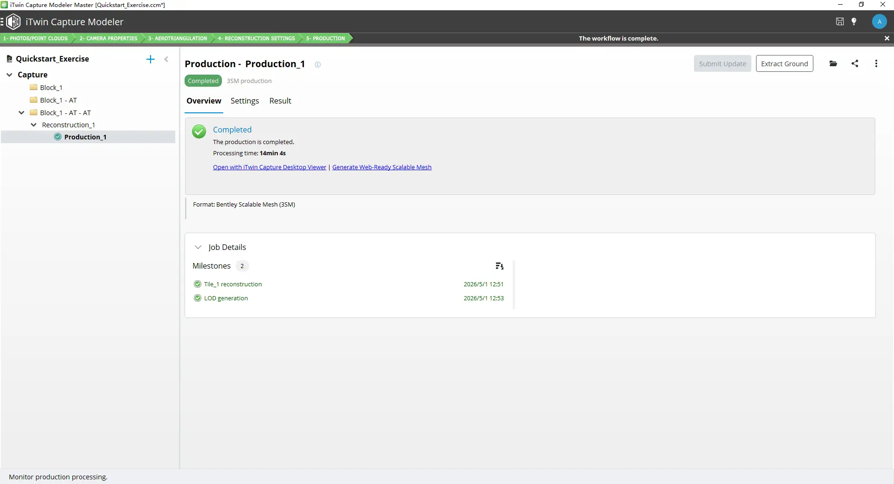

这里不再列处理时长表。66 张照片、单 tile 的 Quickstart 数据主要用于教学，具体耗时对几百张、几千张照片的项目没有多少可迁移价值。真正值得预估的是人工点刺、照片规模、ROI、分块和目标输出，而不是记住这个案例用了多少分钟。

## 查看模型

生成的 3SM 可以直接用 iTwin Capture Desktop Viewer 打开：

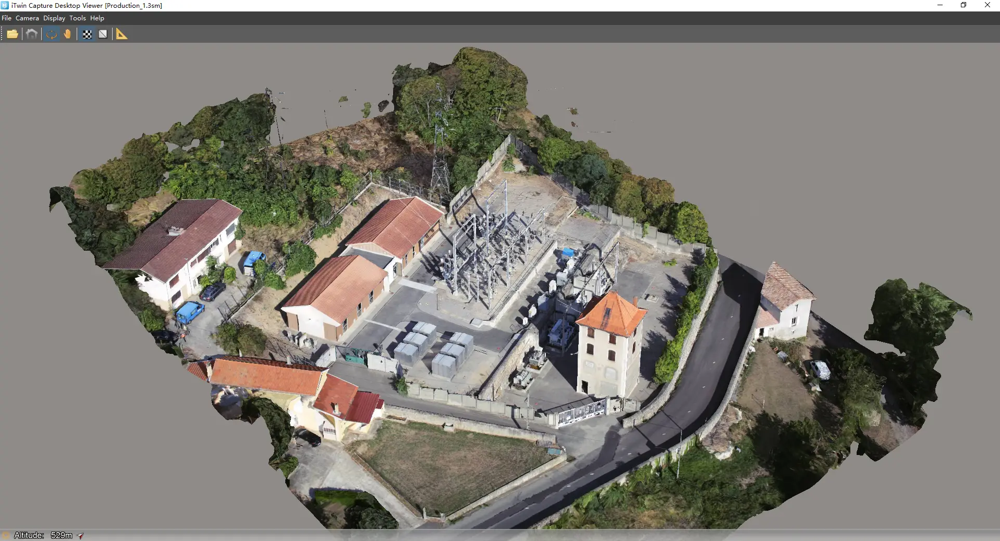

变电站主体、住宅、道路、围墙、树木以及电力设施都已经形成带纹理的三维网格。到这里，主工作流已经结束：

> 照片 → relative AT → Control Points → georeferenced AT → 3D Reconstruction → 3SM

这套数据真正有价值的地方，也正是在这个过程本身。第一次空三说明「照片自己能恢复什么」，控制点说明「真实坐标怎样进入网络」，第二次空三再把两者连接起来。

## 需要其他格式时

3SM 不是唯一输出。后续软件如果有明确格式要求，可以继续基于现有 Reconstruction 提交新的 Production，不需要重新完成照片匹配和空三。

### OSGB

一些既有的倾斜摄影平台和生产流程仍然使用 OSGB。需要这种格式时，在新的 Production 中把 Format 改为「OpenSceneGraph binary (OSGB)」。

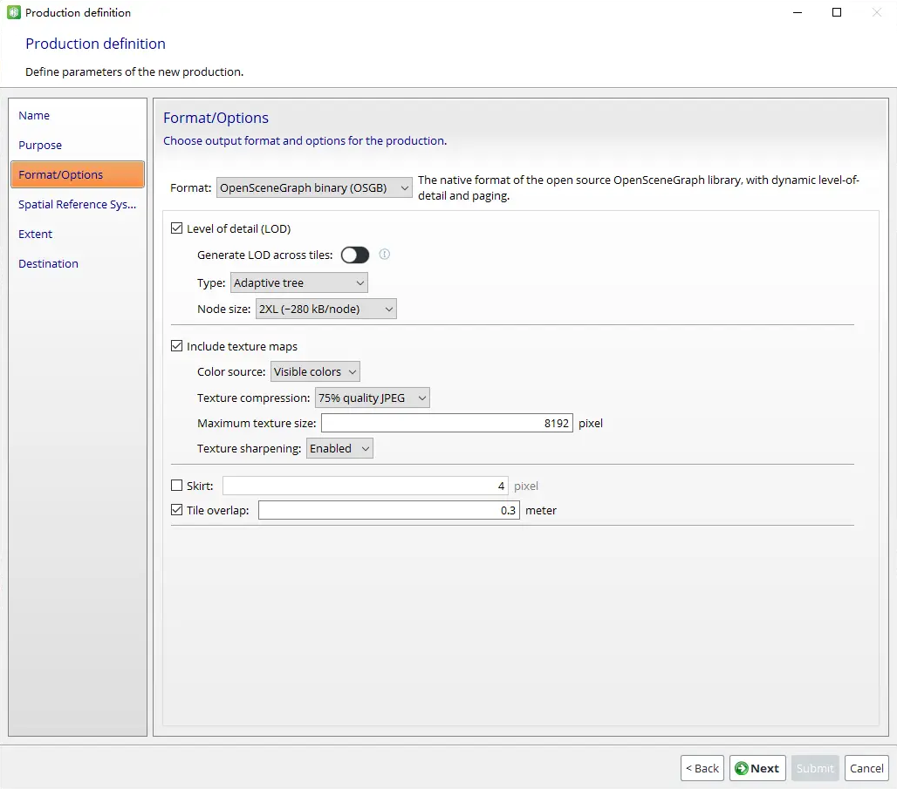

截图记录的是本文这个小项目采用的一组设置，包括 Adaptive tree、Node size、JPEG texture compression、Maximum texture size 和 Tile overlap 等。它们影响文件组织、LOD、纹理质量和体积，但不是 OSGB 项目的统一「标准参数」。下游平台、数据规模和浏览性能要求不同，合适的值也会变化。

因此这里更建议把截图当成「怎么找到这些选项」的示例，而不是照抄一组 2XL、75%、8192 或 0.3 m 后就认为已经得到最优结果。

Spatial Reference System 仍然遵循前面的原则：水平 CRS 和垂直基准按项目数据来，不因为换成 OSGB 就改变坐标定义。

## Gaussian Splatting

本文使用的版本在 Production Purpose 中还提供「Gaussian Splatting (Technical Preview)」。如果 Settings 中的硬件兼容性检查通过，可以基于同一项目单独试一次。

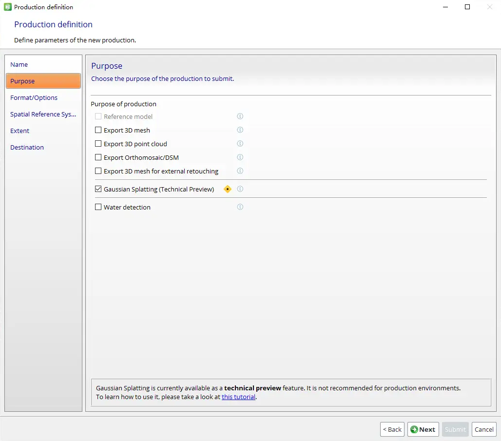

界面明确标注 Technical Preview，所以这里把它看成实验性输出，而不是正式工程成果的默认替代品。

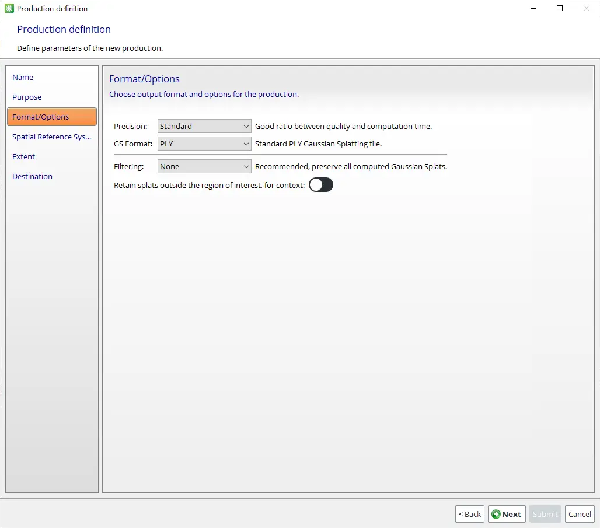

本例使用 Standard precision、PLY 和默认过滤设置。3D Gaussian Splatting 更偏向新视角渲染和视觉表现，与传统摄影测量 mesh 的目标并不完全相同。本文仍然以经过控制和地理参考的摄影测量网格作为需要坐标、距离和工程几何分析时的主成果；3DGS 的概念差异在 [《消费级无人机怎么做三维建模和正射影像》](/consumer-drone-photogrammetry-flight-planning/) 里另有讨论。

## 后续使用

如果后续工作仍在 Bentley 设计环境中，3SM 可以作为 Reality Mesh 进入 MicroStation、OpenRoads、OpenBuildings 等应用，与设计模型叠加使用。

如果目标是 Web 或其他 GIS / 三维平台，应优先根据目标平台当前支持的格式选择生产和转换路线。Bentley 当前已经提供 iTwin Ready、Web-Ready 3SM 和 3D Tiles 等面向发布的工作流，不必把 OSGB 再转其他格式当成唯一的 Web 路径。

如果同一个项目还需要 DSM 或正射影像，可以直接从最终空三 Block 新建一个 Orthomosaic Reconstruction。照片和空三结果可以继续复用，不需要从头重新计算，具体设置参考[上一篇文章](/itwin-capture-modeler-orthophoto/)。

## 相关资料

- [Bentley Quickstart Exercise 教程视频](https://www.youtube.com/watch?v=2E6iK5uzQX8)
- [Bentley Quickstart Exercise 数据集（66 张照片 + `GCPs.txt`）](https://pan.baidu.com/s/1PTb9SfEBw-JjH8h9gKg-wQ?pwd=7ki1)
- [Bentley：Choosing the Right Strategy for Aerotriangulation in iTwin Capture Modeler](https://bentleysystems.service-now.com/community?id=kb_article_view&sysparm_article=KB0043014)
- [Bentley：iTwin Capture Modeler Aerotriangulation Settings](https://bentleysystems.service-now.com/community?id=kb_article_view&sysparm_article=KB0041917)
- [Bentley：Process and Upload Georeferenced Reality Mesh to Reality Management](https://bentleysystems.service-now.com/community?id=kb_article_view&sysparm_article=KB0107815)

---

*本文采用 [CC BY-NC-SA 4.0](https://creativecommons.org/licenses/by-nc-sa/4.0/deed.zh) 协议发布，可自由转载、修改，但需保留作者署名、不可用于商业用途、衍生作品需以相同协议发布。*
