带着 Mini 4 Pro 飞一圈，SD 卡里很快就会多出几百张照片。接下来，这些照片既可以做成一张能放进 CAD 或 GIS 的正射影像，也可以重建成一个带纹理的三维模型。真正麻烦的地方通常不在「按下快门」，而在此之前：飞多高、照片隔多远拍一张、航带怎么排、云台要不要倾斜、什么时候需要像控点。

这篇文章是我最近折腾消费级无人机航拍建模时的一次阶段性整理。它不是测绘规范，也不针对某一款航线规划软件，而是想把「照片为什么能变成模型」「航线为什么要这样设计」「消费级设备的限制到底在哪里」串成一条线。后处理软件的具体操作不在这里展开，但空三、正射纠正、控制点和精度这些概念会讲到，因为如果完全绕开它们，前面的航线参数其实也很难说明白。

主线案例使用 DJI Mini 4 Pro。机型对比还会涉及 Mini 5 Pro、Air 3 / 3S、Mavic 3 系列和 Mavic 4 Pro。文中的数值大多用于解释几何关系，真正执行任务时仍要以实际照片、飞行环境、软件能力和当地法规为准。

[TOC]

## 先说使用边界

消费级无人机当然可以做摄影测量。对园区、校园、村落、工地、景区或单体建筑，只要采集质量合格，一套消费级设备就能完成正射影像、DSM、三维网格等成果，拿来做现状参考、方案底图、内部留档、课堂演示或视觉展示都很实用。

但「能够重建」和「能够作为正式测绘成果使用」是两件事。后者还涉及控制测量、精度检验、坐标和高程基准、作业规范、成果验收以及相关资质。本文讨论的是摄影测量工作流本身，不把消费级方案当成法定测绘或工程验收流程的替代品。

国内无人机管理规则也不适合再用「249 g 以下就不用实名」来概括。现行规则要求民用无人驾驶航空器依法实名登记；飞行活动是否需要申请，则要结合无人机类别、适飞或管制空域、飞行高度和任务性质判断。Mini 系列的低重量仍然会影响分类和部分规则，但「实名登记」和「飞行申请」应当分开看。

另一个容易混淆的问题是自动航线。摄影测量并不是数学上只能自动飞，手动飞行同样可以得到可重建的数据；只是面状航摄需要尽量稳定地控制航高、航向、照片间距和云台姿态，自动航线通常更可靠。具体能否使用航点任务，还要看「机型 + 飞行 App / SDK + 航线格式」的组合。例如 Mini 4 Pro 支持 DJI Fly 的 Waypoint Flight，而 Mavic 2 Pro 等旧机型也曾通过 DJI GS Pro 支持航点任务，不能简单按新旧机型划一道线。

## 从照片到模型，摄影测量在做什么

有一个不算严格、但很直观的比喻：摄影测量是在让电脑玩「反向找茬」。

普通找茬是比较两张图哪里不同；摄影测量反过来，要在许多照片里找到「哪些像素其实对应现实中的同一个点」。同一个墙角、路面标线或石头纹理被多张照片从不同位置拍到以后，这些重复观测就能约束相机和场景的三维关系。

大致可以把过程分成三步：找同名点、空三、重建表面。

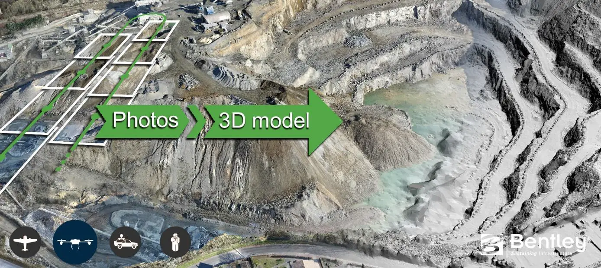

### 找同名点

电脑先在不同照片中寻找能够稳定重复识别的特征。如果一个地物点同时出现在多张照片中，就形成了多视观测。

这件事对照片有几个基本要求：

- 场景要有可识别的纹理。大面积纯色表面很难提供稳定特征。
- 同一片区域要被多张照片覆盖。更多合理分布的观测能增加冗余，但并不是照片越多就一定越好。
- 视角差异要适中。视角几乎一样时，深度几何较弱；差异太大时，同一个特征的外观变化又可能让匹配失败。
- 场景最好保持静止。车辆、行人、风中摆动的树冠都可能破坏多视一致性。

Bentley 早期的采集指南还特别提醒了透明、强反射和缺少纹理的表面。这些问题不是把重叠度再加 10% 就能根治的，而是输入影像本身缺少稳定的几何信息。

### 空三并不只是「算相机位置」

找到大量同名点以后，软件会同时估计空间点、相机位置和姿态，并在需要时调整部分相机内部参数。这一步通常称为空中三角测量（Aerotriangulation，AT），简称空三。

更准确地说，空三是在寻找一组整体上最一致的解：把求得的三维点重新投影回每张照片时，它们应该尽可能落回实际观测到的像素位置。投影位置与实际观测之间的差异，就是常见的「重投影误差」概念。

因此，连接点、相机位姿、焦距和镜头畸变并不是几组彼此无关的参数。它们共同参与一个摄影测量网络的求解。仅靠照片本身通常可以先得到内部一致的相对模型；照片 GNSS、RTK / PPK 或地面控制点再把这个模型与现实坐标系联系起来。

### 从空三到表面、DOM 和 DSM

空三建立的是照片之间的几何骨架。之后软件才能继续恢复更密集的表面，生成点云、三角网和纹理模型。

正射影像也不是普通的「拼大图」。航拍照片属于中心投影，相机姿态、地形起伏和建筑高度都会造成尺度变化与透视位移。正射纠正需要利用相机几何和恢复出的场景表面，把原始影像重新投影到统一的地图坐标中，再完成镶嵌。DSM 则记录地表及其上方建筑、植被等表面的高程。

所以同一批照片既可以走向三维 mesh，也可以走向 DOM / DSM，但它们共享的前提仍然是可靠的影像匹配和摄影测量几何。

## 相机离目标多远，决定照片能有多细

航线规划里最常见的第一个数字是 GSD（Ground Sample Distance，地面采样距离）。它描述照片上一个像素在被摄表面大约对应多大的实际尺寸。

对于垂直摄影，可以用 Bentley 航摄指南中的关系式估算：

$$
R = \frac{L_s D}{fL}
$$

其中：

- $R$ 是 GSD，单位通常为 m/pixel；
- $L_s$ 是与所用像素方向对应的传感器物理尺寸；
- $D$ 是相机到被摄表面的距离；
- $f$ 是真实焦距；
- $L$ 是对应方向的照片像素数。

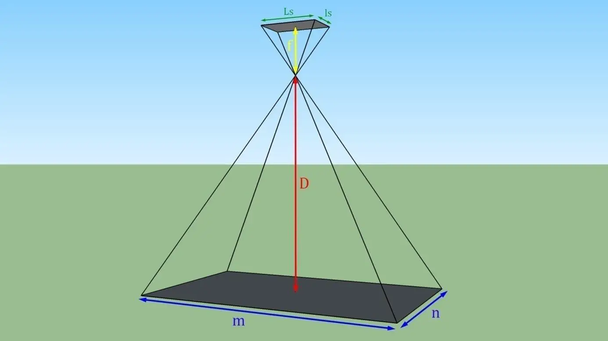

这个式子背后的意思很简单：距离越远，同一个像素覆盖的地面越大；焦距越长、像素采样越密，单个像素覆盖的地面越小。

### 消费级相机怎么处理「等效焦距」

问题是，消费级无人机的规格页通常给 35 mm 等效焦距，而不是完整的传感器毫米尺寸和真实焦距。为了做航线规划，可以把公式改写成一个方便的近似形式：

$$
R \approx \frac{43.27D}{f_{eq}L_{diag}}
$$

这里 $43.27$ mm 是 35 mm 全画幅的对角线长度，$f_{eq}$ 是厂商给出的 35 mm 等效焦距，$L_{diag}$ 是实际照片的对角线像素数。

这个写法更适合消费级机型的快速估算，因为用到的都是厂商比较容易查到的参数。它仍然只是规划阶段的理论值；真正拿到照片以后，最好根据实际照片尺寸、焦距元数据和任务模式再复核一次。

### 用 Mini 4 Pro 算一遍

Mini 4 Pro 主摄最大照片尺寸为 8064 × 6048，24 mm 等效焦距。照片对角线正好是 10080 像素。代入以后：

| 相机到地面的距离 | 理论 GSD |
| --- | --- |
| 50 m | 0.89 cm/pixel |
| 80 m | 1.43 cm/pixel |
| 100 m | 1.79 cm/pixel |
| 120 m | 2.15 cm/pixel |

GSD 与距离近似成正比。飞得低，影像采样更细，但一张照片覆盖的范围也更小，需要更多航带和照片；飞得高则相反。这是航线规划最基础的一组取舍。

## 看得细，不等于位置就准

GSD 很容易和「精度」混在一起，但它们不是同一个量。

Bentley 2017 年的 *Guide for photo acquisition* 给过一个很方便的经验估算：

$$
P \approx 3R
$$

文档里的 $P$ 指三维网格顶点的相对位置精度估计。比如 GSD 为 2 cm/pixel 时，可以把 6 cm 量级理解成一个粗略的相对精度参考，但它不是项目验收指标，也不能由此直接宣布「这个模型精度就是 6 cm」。实际结果仍然会受到影像质量、网络几何、相机模型和重建质量影响。

更重要的是，绝对位置精度还要看模型如何进入真实坐标系。

### 相对精度和绝对精度

如果只靠照片做空三，模型内部的形状和比例可以很稳定，但整体位置、朝向和尺度仍需要外部信息约束。消费级无人机照片里的普通 GNSS 坐标可以提供初始位置和粗略地理参考，但不应该直接当作厘米级控制数据。

常见的外部控制来源包括：

- 精度较低的照片 GNSS，用于粗略定位；
- RTK / PPK 照片位置，用于更高精度的直接地理参考；
- 地面控制点（GCP），把已知地面坐标与照片中的像点观测联系起来。

GCP 的关键不是「地图上有一个坐标」，而是这个点的坐标来自独立、可信的测量，同时在航片中能够清楚识别。Bentley 2018 年的 Drone Capture Guide 曾给过「相邻 GCP 约 20000 像素」的经验量级；例如 GSD 为 2 cm/pixel 时，对应约 400 m。这个数字适合作为历史指南里的经验起点，不应该理解成任何项目都按固定间距布点。

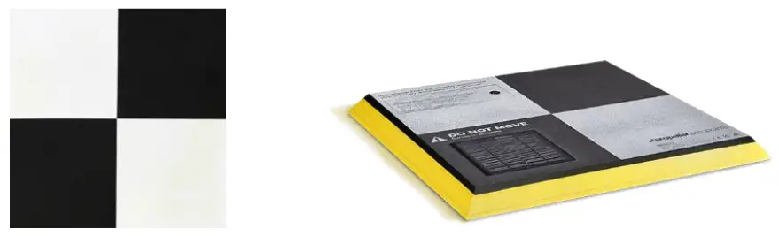

如果只是从现有地图或卫星底图上提取一个近似坐标，它更适合叫「粗略参考点」，用于把模型大致放到正确位置，而不是与实测 GCP 混为一谈。

实际需要验证精度时，还应该保留独立的检查点（Check Point）。控制点参与平差，是在帮助模型建立地理参考；检查点不参与拟合，用来检查模型对独立已知点的预测误差。两者的角色不同。

## 重叠度不是一个数学常数

「航向 80%、旁向 60%」几乎成了无人机航测的固定搭配，但这个数并不是从某个简单公式严格推导出来的。

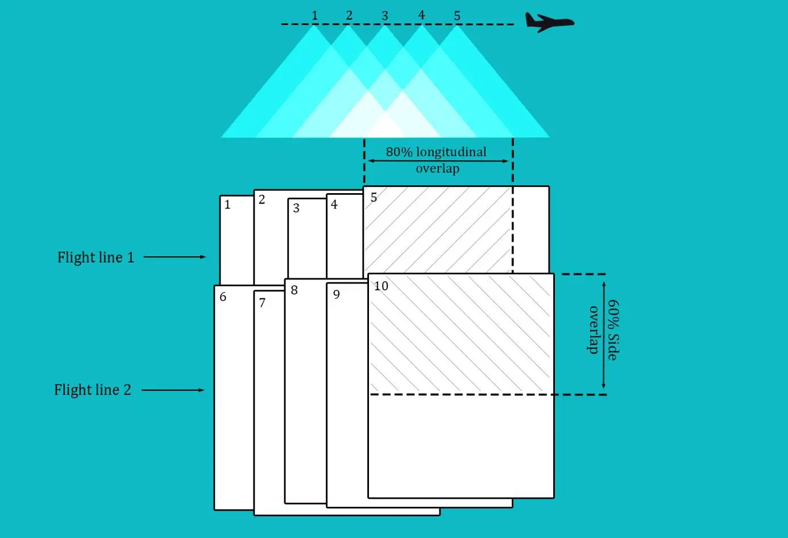

重叠的目的，是让同一片地物被足够多、几何关系合理的照片重复观测。提高重叠通常能增加匹配冗余和空三稳健性，但也会增加照片数量、飞行时间和处理量。

Bentley 自己的两份旧指南就给过不同的推荐：2017 年的正射 / DSM 章节采用 80% 航向、60% 旁向；2018 年的 Drone Capture Guide 对 nadir grid 又给过 70% / 60%。这恰好说明它首先是工程参数，而不是摄影测量定律。

如果没有更具体的项目经验，我会把 80% / 60% 当作消费级垂直航摄一个偏保守的起点，然后根据场景调整：纹理差、地形复杂或定位不稳定时增加冗余；数据量受限时再谨慎降低。不要把「至少三张照片看到同一点」反推成「所以 80% 必然正确」，这两者不是同一层面的结论。

### 航向和旁向间距怎么算

重叠率真正落到航线里，计算的是相邻照片中心和相邻航带之间的距离。

最好不要把公式写成「长边一定对应航向」「短边一定对应旁向」，因为照片方向可能变化。更稳妥的是直接定义：

- $N_{\parallel}$：照片沿飞行方向的像素数；
- $N_{\perp}$：照片垂直飞行方向的像素数；
- $p$：航向重叠率；
- $q$：旁向重叠率。

那么：

$$
\Delta_{\parallel}=R N_{\parallel}(1-p)
$$

$$
\Delta_{\perp}=R N_{\perp}(1-q)
$$

以 Mini 4 Pro 80 m 为例，GSD 约 1.43 cm/pixel。假定常规横向照片的短边沿航向、长边横跨航带，则单张照片约覆盖 86.5 m × 115.3 m。

按 80% 航向重叠和 60% 旁向重叠计算：

- 航向拍照间距约 17.3 m；
- 航带间距约 46.1 m。

这两个方向一旦用反，航线数量和照片数量都会跟着算错，所以在自己写航线规划器时，最好直接以「沿航向 / 垂直航向」定义像素方向。

## 几类常见的采集几何

不同软件的按钮名称并不统一，但从摄影测量几何上看，常见任务大致可以归到几种形态：线状采集、平行航带、面状垂直航摄、倾斜格网和环绕采集。

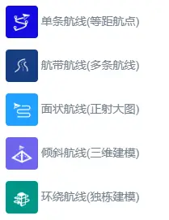

它们不是严格的行业分类，更像是从目标形状和观察方向出发的一种实用整理。

### 单条航线和航带航线

道路、河流、管线等狭长目标，可以沿主方向布置一条或多条平行航带。照片沿航线按距离触发，航带之间再按照旁向重叠排列。

这类任务的难点通常不是公式，而是转弯和弯曲目标。路线一旦明显弯折，内外侧覆盖关系会发生变化；简单的等距航点未必还能维持稳定重叠。对较宽的走廊目标，直接用多条航带覆盖往往比沿中心线硬拐更稳妥。

### 面状航摄：正射和 DSM 的基础

大面积正射影像最基础的采集方式，是一组具有足够重叠的平行 nadir 航带，云台垂直向下。

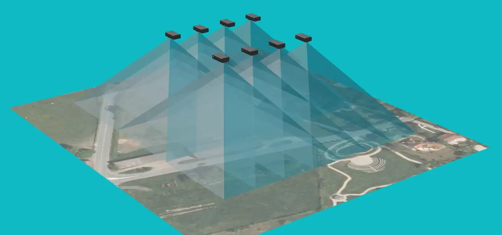

对于地形和地物相对简单的项目，这样就可以生产 DOM 和 DSM。所谓「面状航线必须飞井字」并不准确，交叉格网是增强网络几何的一种办法，而不是面状航摄的定义。

#### 为什么纯垂直航摄有时会弯

Bentley 2017 年的采集指南专门讨论过一个经典问题：纯 nadir、单一方向的直线航带，加上比较平坦的场景，可能形成径向畸变自标定的临界几何。空三在相机畸变和场景形变之间出现歧义，结果可能呈现整体的碗状或船底状弯曲。

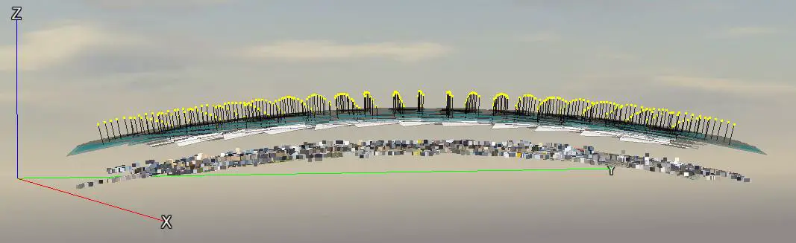

这类问题不是某个软件独有的 bug，而是摄影测量网络几何和相机自标定之间的耦合。

可用的改善思路不止一种：

- 增加交叉方向的航带，改变网络几何；
- 加入一定数量的倾斜影像；
- 使用可靠的相机标定参数；
- 加入精度足够的外部位置或控制约束。

旧版 ContextCapture 指南很重视预标定相机，但不要把这直接理解成「今天所有消费级任务每次都必须先标定一次」。软件、自标定策略和定位条件都已经变化。真正应该记住的是：如果网络几何本身接近退化配置，就不能只靠「照片够多」来解决。

### 倾斜航摄：把立面带进模型

只拍 nadir，对地面和屋顶很友好，对垂直墙面却天然观察不足。要重建建筑立面、檐口、设备侧面或复杂地形的坡面，就需要加入倾斜照片。

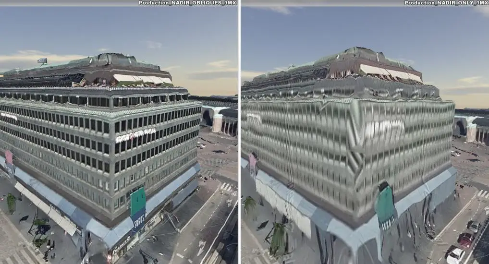

行业级大面积倾斜摄影常见多相机系统，例如一颗垂直相机配合四个方向的倾斜相机，同时获得 nadir 和多向 oblique 影像。Bentley 2017 年的指南就给过 1 个 nadir + 4 个 oblique camera 的示例。

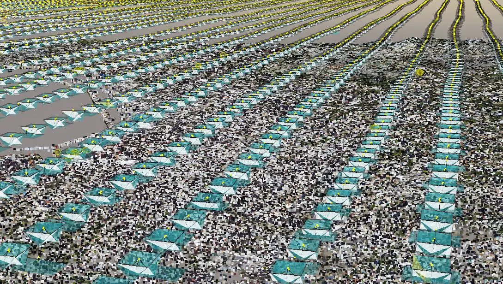

消费级无人机通常只有一套云台相机，不可能在同一时刻得到五个观察方向，但可以通过多条航线或多架次采集补足视角。这里没有一个所有场景通用的「三向最佳方案」。更实用的思路是先问：最终模型究竟需要哪些表面被多角度看到。

一个常见组合是：

- 一组 nadir 航带，保证地面和屋顶；
- 一组或多组倾斜航带，补充建筑立面；
- 对特别重要的单体，再增加环绕采集。

如果只做三维展示而不特别需要纯垂直顶面，也可以采用倾斜格网。Bentley 2018 年的 Drone Capture Guide 给出过一种 oblique grid：相机固定向前倾斜，沿两个互相垂直的轴往返飞行，借助去程和回程获得四个观察方向。

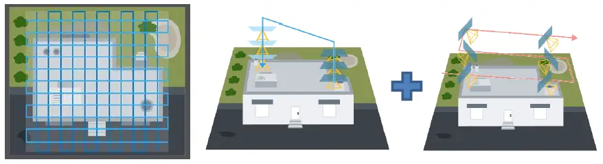

这种做法的价值在于用单云台获得更多观察方向，而不是简单把「五向」压缩成某个固定的两架次或三架次公式。具体架次、旁向重叠和是否需要 nadir，应按目标高度、遮挡程度和电池条件决定。

#### 倾斜角先统一定义

不同资料对「30°」「45°」的定义经常相反。本文后面统一采用摄影测量里比较常见的定义：

> 倾斜角 $\alpha$ 指相机光轴偏离铅垂向下方向的角度。

因此：

- $\alpha=0°$：垂直向下，对应 DJI 云台约 -90°；
- $\alpha=30°$：对应 DJI 云台约 -60°；
- $\alpha=45°$：对应 DJI 云台约 -45°；
- $\alpha=60°$：对应 DJI 云台约 -30°，已经明显接近水平观察。

大面积三维航摄通常会把 30°～45° 作为较常见的工作区间。倾角继续增大，可以看到更多立面，但照片远近端尺度差异、天空占比和遮挡关系都会变得更明显。针对高塔、悬崖等单体目标，可以在环绕采集中使用更接近水平的视角，但不应该把 60° 当作面状倾斜航摄的默认值。

### 倾斜照片里没有一个统一 GSD

倾斜以后，照片在平面地面上的投影不再是规则矩形，近端和远端的采样尺度不同。

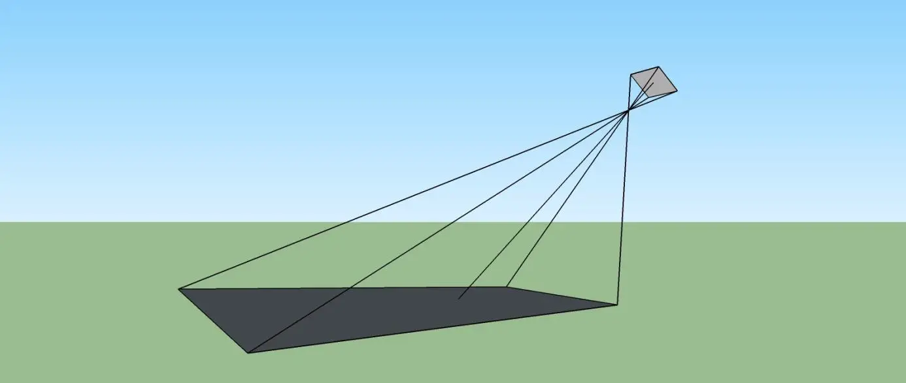

如果相机高度为 $H$，倾斜角为 $\alpha$，光轴落点到相机的斜距为：

$$
D=\frac{H}{\cos\alpha}
$$

这个斜距可以帮助理解为什么倾斜后采样变粗，但不能把整张照片简化成一个统一的「斜距 GSD」。在照片中心附近，横向于倾斜方向的尺度大致按 $1/\cos\alpha$ 增长，沿倾斜方向的尺度变化会更快，而且远近端仍然不同。

因此，倾斜航摄更应该关注完整的投影覆盖和最不利区域，而不是把 nadir 的一个 GSD 数字直接乘上斜距比例就结束。

### 环绕航线：单体目标更合适

对于雕塑、单栋建筑、塔架、古树或变电站设备，环绕往往比大面积格网更自然。无人机围绕目标飞行，云台始终朝向目标，让同一表面从连续变化的方向被反复观察。

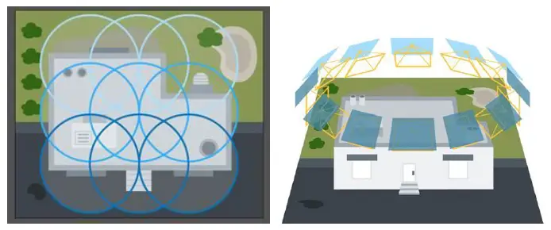

Bentley 2018 年的指南给过两组很实用的经验：相邻照片对目标的观察方向差异最好不超过约 15°，因此完整一圈至少约 24 张；对于复杂场景，可以使用多个相互重叠的圆环，圆环直径之间保持至少约 50% 的重叠。

如果目标有明显高度，还可以增加不同高度的环绕，让屋顶、立面和低处结构获得更完整的观察。

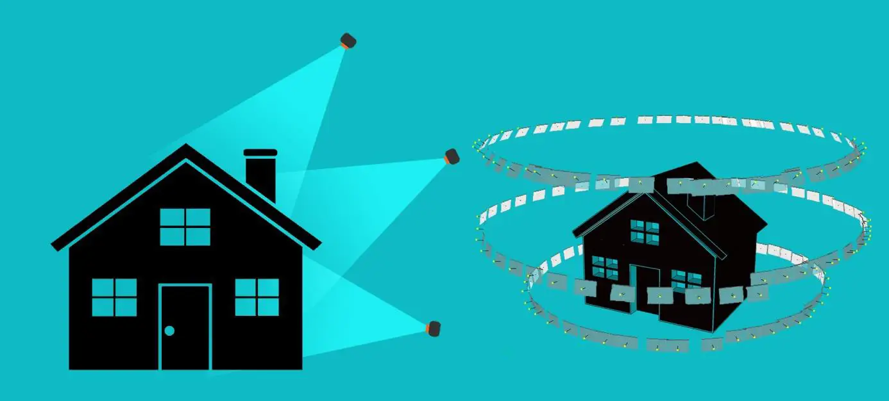

这里真正需要控制的是可见性，而不是机械规定「必须三层」或「必须五层」。目标越复杂、遮挡越多，就越需要从不同高度补视角。

### 快速对照

| 采集方式 | 适用目标 | 相机方向 | 参数起点 |
| --- | --- | --- | --- |
| 单条 / 少量航带 | 道路、河流、走廊 | 多为垂直 | 航向重叠优先保证 |
| 面状 nadir | DOM、DSM、大面积俯视成果 | 垂直向下 | 可从 80% / 60% 起步 |
| 交叉格网 | 需要增强网络几何的面状任务 | 垂直或混合 | 在基本格网上增加另一方向 |
| 倾斜格网 | 城区、园区三维模型 | 常见 30°～45° from vertical | 根据遮挡和目标调整 |
| 环绕 | 单体建筑、塔架、复杂设备 | 持续对准目标 | 相邻观察方向约 ≤15° |

## 消费级机型真正限制了什么

无人机对摄影测量的影响，不只是一张参数表里的「像素越高越好」。相机采样、镜头质量、快门方式、自动航线能力、定位精度和续航都会改变采集策略。

下面只列几款机型主摄与航拍建模直接相关、且能从 DJI 当前规格页明确查到的参数。100 m GSD 按前面的等效焦距近似公式和最大静态照片尺寸计算，只用于横向比较。

| 机型 | 建模主摄 | 最大照片尺寸 | 等效焦距 | 100 m 理论 GSD | 起飞重量 | 官方最大飞行时间 |
| --- | --- | --- | --- | --- | --- | --- |
| Mini 4 Pro | 1/1.3" 48 MP | 8064 × 6048 | 24 mm | 1.79 cm | <249 g | 34 min |
| Mini 5 Pro | 1" 50 MP | 8192 × 6144 | 24 mm | 1.76 cm | 约 249.9 g | 36 min（标准电池） |
| Air 3（广角） | 1/1.3" 48 MP | 8064 × 6048 | 24 mm | 1.79 cm | 720 g | 46 min |
| Air 3S（广角） | 1" 50 MP | 8192 × 6144 | 24 mm | 1.76 cm | 724 g | 45 min |
| Mavic 3 | 4/3 20 MP 哈苏 | 5280 × 3956 | 24 mm | 2.73 cm | 895 g | 46 min |
| Mavic 3 Classic | 4/3 20 MP 哈苏 | 5280 × 3956 | 24 mm | 2.73 cm | 895 g | 46 min |
| Mavic 3 Pro | 4/3 20 MP 哈苏 | 5280 × 3956 | 24 mm | 2.73 cm | 958 g | 43 min |
| Mavic 4 Pro | 4/3 100 MP 哈苏 | 12288 × 8192 | 28 mm | 1.05 cm | 约 1063 g | 51 min |

表里的「官方最大飞行时间」是在厂商测试条件下得到的上限，不是摄影测量任务的可用航时。实际任务还要给返航、电量预警、风和转场留余量。

### 高像素能让 GSD 更细，但不等于影像更可靠

Mini 4 Pro 在 100 m 的理论 GSD 比 Mavic 3 系列更细，这并不矛盾。GSD 描述的是几何采样密度，而照片能否稳定提取特征，还会受到镜头解析力、运动模糊、曝光、噪声、动态范围、压缩和相机内部处理影响。

因此不要用单个 GSD 数字给机型排「建模画质榜」。对于摄影测量来说，一张锐利、曝光稳定、边缘可用的照片，往往比名义像素更高但细节不稳定的照片更有价值。

### 多摄不是不能用，关键是别混成同一台相机

Air 3、Air 3S、Mavic 3 Pro 和 Mavic 4 Pro 都有多个焦段。摄影测量并不排斥多相机数据，行业级倾斜摄影本来就经常同时使用多颗相机；问题在于不同镜头有不同的内参和畸变模型，软件必须正确把它们作为不同相机组处理。

对消费级的单机任务，始终使用同一颗广角主摄、固定焦段，是最简单也最容易复现的选择。中长焦不是「绝对不能建模」，只是视场更窄、航线密度更高，而且混用时相机组管理会明显复杂。

### 普通 GNSS 和 RTK 的差别主要体现在绝对定位

消费级机型没有测绘型 RTK，不代表内部三维几何就一定很差。空三仍然主要依赖多视影像关系；普通照片 GNSS 更适合用作初始位置和粗略地理参考。

如果任务要求模型与已有工程坐标精确叠加，或者需要对绝对位置进行验证，就应该引入精度等级匹配的外部控制，并设置独立检查点。是否需要 GCP，取决于成果目的，而不是「消费级无人机一律必须打像控」。

## 到这里，怎样规划一次任务

真正准备起飞时，可以按下面的顺序判断。

第一步，先确定成果是什么。只做 DOM / DSM，就以 nadir 航摄为主；需要完整立面，就加入倾斜或环绕；只做视觉展示，也可以接受更灵活的采集几何。

第二步，确定对空间位置的要求。只关心相对形状，可以不专门布控制；需要与工程坐标准确叠加，就要考虑 RTK / PPK 或实测 GCP，并保留检查点。

第三步，根据相机和目标 GSD 估算合适的离地距离，再检查法规、安全净空和图传条件是否允许。GSD 是规划输入，不是最终精度承诺。

第四步，根据目标形状选择采集几何。规则面状区域用平行航带；需要增强网络时再加交叉或倾斜；窄长区域用航带；单体目标优先考虑环绕。

第五步，检查任务是否会跨电池、跨明显地形高差或跨多个遮挡区域。必要时先分区，而不是把一个超大任务硬塞进一条航线。

到这里，其实已经足够完成大多数消费级航拍建模任务。下面再往下走，就属于「把航线规划工具的黑盒拆开看看」。

## 航线规划工具内部在算什么

假设输入是用户在地图上画出的测区多边形，再加上机型、飞行高度和重叠度。一个基础规划器最终要输出的，不只是「一堆航点」，而是完整的飞行线段、转场和照片触发规则。

### 先把经纬度变成平面坐标

地图界面通常保存的是经纬度。经纬度单位是度，不能直接拿来做「平移 46 m」「Buffer 30 m」这样的欧氏几何运算。

因此，实际计算前应该先把测区转换到合适的局部投影坐标系或局部米制平面，在这个平面里做距离、旋转、相交和缓冲；航线生成完成后，再把结果转换回 WGS 84 经纬度。

这一小步经常被教程省略，但自己写工具时不能省。

### 选择一个合适的 sweep direction

对于规则、狭长、近似凸的测区，让航带沿长方向飞通常能够减少转弯次数。一个简单的启发式，是先计算多边形的最小面积外接矩形（Minimum Bounding Rectangle，MBR），再把矩形长边方向作为候选航向。

MBR 是能完全包住多边形、面积最小的旋转矩形，不是普通的轴对齐 Bounding Box。

对于已经求出的凸包，可以用 Rotating Calipers（旋转卡壳）在线性扫描中检查候选外接矩形。这个算法很适合在文章里解释「主方向怎么找」，但需要注意：

> MBR 长边只是一个实用航向启发式，不等于任何测区的全局最优航向。

真正的航线优化还可能同时考虑航带数量、总飞行距离、转弯时间、转场和禁飞区域。对于复杂测区，最小面积矩形和最短执行时间并不是同一个目标函数。

### 核心对象应该是航带，不是航点矩阵

得到候选航向以后，更合理的基本流程是生成一组平行 sweep lines，然后让这些直线与待覆盖区域求交，得到真正需要飞行的航带线段。

这比「先在 MBR 里铺满航点，再删除多边形外的点」可靠得多。摄影测量真正需要覆盖的是照片 footprint，不是航点中心。边界外的一个照片中心，可能恰好负责覆盖测区边缘；如果按 point-in-polygon 直接删掉，反而会造成边界缺图。

对于简单凸多边形，一组往返平行航带已经够用。遇到 U 形、带孔洞或存在禁飞区的复杂多边形，同一条 sweep line 可能与测区形成多个不连续线段，这时就进入 Coverage Path Planning 的问题，需要考虑区域分解和不同航段之间的转场顺序。

这里不再往机器人路径规划里继续展开，知道这个边界就够了。

### 航摄余量和飞行边界不是同一个概念

为了保证测区边缘仍然有足够的照片冗余，通常需要让采集范围略微超出最终成果 AOI。这可以理解成 acquisition margin。

它不应该机械写成「外扩 0.5～1 个航带间距」，因为合理余量取决于照片 footprint、重叠度和希望保留的边界冗余。

更重要的是，成果测区和允许飞行的边界必须分开。如果用户画的是「我要建模这一块」，可以在安全允许时向外增加航摄余量；如果这个边界本身就是不可越过的飞行限制，就不能为了覆盖效果自动 Buffer 到外面。

### Waypoint、Flight Line 和 Photo Trigger 是三件事

航线软件里经常把「航点数」和「照片数」混在一起，但面状航摄不必每拍一张都悬停一个航点。

更合理的三个概念是：

- Waypoint：控制飞机在哪儿转向、改变高度或切换动作；
- Flight Line：真正执行摄影测量采集的直线航段；
- Photo Trigger：沿直线航段按距离或时间触发拍照。

按距离连续触发，通常比「每 17 m 设置一个航点 → 到点悬停 → 拍照」更接近传统航带的思路，也能减少反复减速和加速。

### 500 m × 300 m 的简单估算

仍然以 Mini 4 Pro、80 m、80% / 60% 为例。在照片短边沿航向的假设下，航向触发间距约 17.3 m，航带间距约 46.1 m。

如果一个矩形测区沿航向长 500 m、横向宽 300 m，而且暂时不计航摄余量和首尾扩展，大致会得到 8 条左右的航带，每条约 30 张照片，也就是两百多张的量级。

真实规划还要考虑边界扩展、航带首尾、转弯和具体多边形形状，所以这个数字只用来验证数量级，不适合当作精确任务预算。

### KMZ / WPML 到底是什么

DJI 公开的 WPML 航线格式采用 KMZ 封装。KMZ 本质上是 ZIP 容器，标准中包含 `template.kml`、`waylines.wpml`，还可以包含资源目录 `res`。其中模板描述任务级属性，`waylines.wpml` 描述可执行航线和动作。

一个航点片段大致会出现这样的信息：

```xml
<Placemark>
  <Point>
    <coordinates>115.5469160887141,38.8901358837714</coordinates>
  </Point>
  <wpml:index>0</wpml:index>
  <wpml:executeHeight>50</wpml:executeHeight>
  <wpml:waypointSpeed>8</wpml:waypointSpeed>
</Placemark>
```

但这里的 `50` 不能脱离 `executeHeightMode` 单独理解：WPML 会明确声明高度参考方式，例如 WGS 84 高度或相对起飞点高度。照片动作也不只支持「到达航点拍照」，规范还包含按时间或按距离连续触发的方式。

这里还有一个产品边界必须说清楚：DJI 公布的 WPML 文档主要服务于 Pilot 2 / FlightHub 2 / Cloud API 等企业生态，不能因为文件扩展名同样是 KMZ，就直接推断任意自定义 WPML 都能导入某一款消费级 DJI Fly。具体导入链路必须按机型、App 和实际工具验证。

### 自己做一个基础规划器，难点在哪里

如果目标只是规则多边形的基础格网，实现原型确实不算神秘：地图画 AOI、投影到米制平面、选一个航向、生成平行航带、与多边形求交、按距离生成拍照触发，最后导出目标格式。

真正把它做成可靠产品以后，复杂度才会迅速增加：凹多边形和孔洞、飞行边界、障碍物、地形、机型能力、转场、任务中断恢复、高度基准、航线格式兼容以及各种边界条件都会进来。

所以「基础算法并不复杂」和「成熟航线规划软件不复杂」是两回事。

## 进阶：起伏地形和预计算仿地

前面所有 GSD 和重叠计算都有一个隐含前提：相机到地面的距离基本稳定。

如果测区存在明显起伏，而无人机始终保持同一个相对起飞点高度，这个前提就会失效。

假设航线相对起飞点高度为 $H$，起飞点地面高程为 $Z_0$，某处地面高程为 $Z_i$，则该处相机离地距离近似为：

$$
D_i=H-(Z_i-Z_0)
$$

地势升高时，$D_i$ 变小；地势降低时，$D_i$ 变大。

这会同时带来三类变化：

- 高地离相机更近，GSD 更细，但照片 footprint 变小；
- 低地离相机更远，GSD 更粗，但 footprint 变大；
- 高地的净空同时减小，是安全上更需要关注的位置。

### 定高航线里，重叠变化的方向很容易想反

如果航向拍照间距已经按距离 $D_0$ 和重叠率 $p_0$ 规划，并保持固定触发间距，则其他地面距离 $D$ 下的重叠率可以近似写成：

$$
p(D)=1-(1-p_0)\frac{D_0}{D}
$$

例如原计划 80 m AGL、80% 航向重叠：

- 低洼处离地变成 120 m，重叠反而会增加到约 86.7%；
- 山头处只剩 40 m，重叠会下降到约 60%。

所以危险组合是「高地 + footprint 缩小 + 重叠下降 + 净空减少」，而不是低地重叠不足。

### 先分清几种高度

仿地最容易出问题的地方不是 DEM 插值，而是把不同高度基准混在一起。

至少要区分：

- AGL：相机相对当地地面或被摄表面的高度；
- 相对起飞点高度：相对 Home Point / 起飞点的高度；
- WGS 84 椭球高；
- EGM96 等大地水准面相关高程；
- DEM / DSM 自己采用的垂直基准。

摄影测量最关心的是相机到被摄表面的距离，也就是类似 AGL 的概念；但飞行 App 和航线文件未必使用 AGL 作为输入。例如 DJI Fly 的 Waypoint Flight 中，航点高度按相对起飞点理解。两者之间必须经过地形高程换算。

如果目标是始终保持约 $h$ 的离地高度，并且地面高程都使用同一个垂直基准，那么第 $i$ 个位置相对起飞点应设置的高度可以写成：

$$
h_i=h+(Z_i-Z_0)
$$

这就是最基本的「预计算仿地」思想。

### DEM 是规划输入，不是避障保证

公开 DEM 可以用来提前估计地形。SRTM 1 Arc-Second Global 的水平采样间隔约为 1 arc-second，也就是赤道附近约 30 m。这里的「30 m」是网格空间采样，不是高程误差，也不能据此推导「额外留 30 m 就一定安全」。

粗分辨率 DEM 还可能把山脊、沟谷、陡坎等小尺度地形平滑掉。因此，公开 DEM 更适合规划参考，不应该单独承担障碍物净空保证。安全余量还要考虑 DEM 垂直误差、地形突变、植被、建筑物和实际飞行环境。

### 自己生成的 DSM 更细，也不等于 Z 一定更准

另一种思路是先做一次较粗的航摄，生成 DSM，再据此规划第二阶段航线。自建 DSM 的空间分辨率通常能比全球公开 DEM 高很多，对局部地形描述更细，但它的绝对高程仍然取决于照片定位、控制点和高程基准。

「表面很细」和「绝对 Z 很准」仍然是两个问题。

同时，摄影测量 DSM 不能当成完整的障碍物数据库。建筑物等大尺度表面可以作为规划参考，电线、细枝和其他小型障碍物则不应依赖 DSM 保证净空。

### 高度控制点也不等于拍照点

如果只在拍照点查询 DEM，高度规划仍然可能漏掉两张照片之间的山脊。真正的预计算仿地应该沿整条飞行线以足够密的间隔采样地形剖面，根据地形变化插入必要的高度控制点；照片则仍然可以沿航段按距离独立触发。

这和前面把 Waypoint、Flight Line、Photo Trigger 分开的思路是一致的。

### 什么时候值得做仿地

我不再用「高差占飞行高度 20% / 60%」这样的固定分档。更有用的判断方法，是先算定高航线下整个测区的 $D_{min}$ 和 $D_{max}$，再看由此产生的：

- 最细和最粗 GSD；
- 最低重叠率；
- 最小净空。

如果这些变化仍在任务可以接受的范围内，定高航线最简单；如果已经明显影响覆盖或安全，可以先分区设置不同高度，再考虑更复杂的预计算仿地。对消费级设备来说，分区定高往往比未经验证的自定义仿地链路更容易检查和控制。

如果采用「先粗建模、再根据 DSM 规划第二阶段航线」的方案，第一阶段照片可以只用于规划，不必和第二阶段照片一起进入最终重建。这样两次飞行之间的光照变化不会自动成为最终数据集的问题；真正增加的是一次外业、一次粗处理和一轮质量检查的成本。

## 几个容易忽略的采集问题

### 透明、反光和运动目标

玻璃幕墙、水面、镜面金属、车辆和风中植被都可能破坏多视一致性。调整航线可以改善可见性，但不能改变它们的物理特性。实际处理通常是接受局部缺陷、换拍摄条件、补充视角，或者在后处理中排除问题区域。

### 光照和快门比「天气标签」更重要

均匀光照通常有利于影像匹配，但没有必要机械追求「只能阴天」或「只能正午」。真正需要避免的是大量过曝 / 欠曝、严重运动模糊，以及在长时间采集过程中出现过强的场景变化。

风也不适合用「三级以上就不能建模」这样的固定阈值判断。无人机标称抗风能力、安全飞行能力和摄影测量所需的姿态稳定性不是同一件事。实际更应该看瞬时阵风、飞行速度、快门速度和目标附近的湍流情况。

### 跨电池任务要保证连续覆盖

大测区往往会跨电池。与其规定一个固定的「30% 架次重叠」，更重要的是保证两个架次之间仍有完整的航带和照片冗余，不要把任务恰好切在只剩一列边缘照片的位置。自动航线如果支持任务续飞，也要检查续飞点附近的覆盖是否仍然满足摄影测量需要。

### 控制点要有空间代表性

需要布 GCP 时，不要只追求数量。点位在平面上的分布、高程变化、边缘覆盖和可识别性都很重要。更关键的是，控制点和检查点必须有独立可靠的坐标来源；来自底图的近似点不能替代实测控制。

## 顺带说一下 3D Gaussian Splatting

同一批航拍照片现在还经常被拿去做 3D Gaussian Splatting（3DGS）。它和传统摄影测量有重叠，但目标并不一样。

原始 3DGS 工作首先面向 novel-view synthesis，也就是从已有照片学习一个能够高质量、实时渲染新视角的场景表示。经典流程会从相机标定 / SfM 得到的相机位姿和稀疏点出发，再优化大量三维高斯。

因此，把 3DGS 概括成「不需要摄影测量、稀疏乱拍也比 SfM 更稳」并不准确。后来之所以专门出现 COLMAP-Free 3DGS 等研究，也正说明传统 3DGS 工作流对准确相机位姿有明显依赖。

两类成果真正的区别更接近目标侧重点：摄影测量工作流天然围绕相机几何、坐标参考和可量测的点云 / mesh 展开；3DGS 更强调新视角渲染和视觉表现。现在也有越来越多工作在增强 Gaussian 表示的几何能力，所以不需要把二者说成绝对对立。

对本文讨论的工程底图和模型用途，我仍然会优先把经过地理参考和检查的摄影测量成果当作几何依据；如果目标是实时展示、漫游和视觉效果，3DGS 则是另一条很值得折腾的路线。

---

回到最开始的问题：消费级无人机能不能做三维建模和正射影像？当然可以。真正决定结果上限的，并不是某个软件里那一组「推荐参数」，而是照片本身的质量，以及这些照片在空间里如何采样场景。

GSD 告诉你拍得有多细，重叠和观察角度决定摄影测量网络是否稳，外部控制决定模型怎样进入真实坐标系，地形又会反过来改变 GSD、覆盖和净空。把这些关系串起来以后，航线规划软件里的数字就不再是几个需要背下来的默认值，而是可以根据任务重新判断的参数。

这也是我这段时间折腾下来最有用的一点：先知道最终要什么成果，再决定照片应该怎样拍。照片是后面所有计算的起点，采集阶段留下的缺口，通常很难指望后处理凭空补回来。

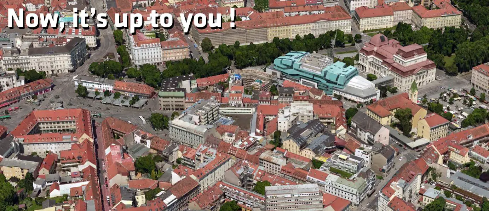

## 参考资料

本文的摄影测量原理与采集方法主要参考以下资料，消费级机型参数和法规信息则按文章更新时的官方资料核对：

- Bentley Systems, *ContextCapture | Guide for photo acquisition*, 2017 年 3 月.
- Bentley Reality Modeling Academy, *Reality Modeling Drone Capture Guide*, 2018 年.
- [DJI Mini 4 Pro 官方规格](https://www.dji.com/mini-4-pro/specs)
- [DJI Mini 5 Pro 官方规格](https://www.dji.com/mini-5-pro/specs)
- [DJI Air 3 官方规格](https://www.dji.com/air-3/specs)
- [DJI Air 3S 官方规格](https://www.dji.com/air-3s/specs)
- [DJI Mavic 3 / Mavic 3 Classic / Mavic 3 Pro 官方规格与支持页面](https://www.dji.com/products/comparison-consumer-drones)
- [DJI Mavic 4 Pro 官方规格](https://www.dji.com/mavic-4-pro/specs)
- [DJI Fly Waypoint Flight 官方说明](https://support.dji.com/help/content?customId=en-us03400007343&documentType=artical&lang=en&paperDocType=paper&re=US&spaceId=34)
- [DJI GS Pro 官方页面](https://www.dji.com/ground-station-pro)
- [DJI WPML 航线格式说明](https://developer.dji.com/doc/cloud-api-tutorial/en/api-reference/dji-wpml/overview.html)
- [中国民用航空局《无人驾驶航空器飞行管理暂行条例》](https://www.caac.gov.cn/XXGK/XXGK/FLFG/202401/t20240115_222642.html)
- [中国民用航空局《民用无人驾驶航空器实名登记和激活要求》政策解读](https://www.caac.gov.cn/XXGK/XXGK/ZCFBJD/202604/t20260421_230620.html)
- [USGS SRTM 数据说明](https://www.usgs.gov/centers/eros/science/usgs-eros-archive-digital-elevation-shuttle-radar-topography-mission-srtm-1)
- Kerbl et al., [*3D Gaussian Splatting for Real-Time Radiance Field Rendering*](https://arxiv.org/abs/2308.04079), 2023.
- Fu et al., [*COLMAP-Free 3D Gaussian Splatting*](https://arxiv.org/abs/2312.07504), 2023.

---

*本文采用 [CC BY-NC-SA 4.0](https://creativecommons.org/licenses/by-nc-sa/4.0/deed.zh) 协议发布，可自由转载、修改，但需保留作者署名、不可用于商业用途、衍生作品需以相同协议发布。*
